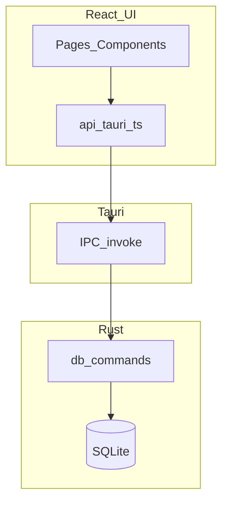

# PrisonSIS-Tauri 项目完整开发计划

## 1. 文档信息

- **产品**：监狱审讯笔录系统（PrisonSIS）桌面客户端（Tauri 版）
- **技术栈**：Tauri 2、Rust、SQLite、React、TypeScript、Vite
- **仓库现状**：UI 壳较完整；Rust 数据层部分实现；多数业务页为 mock/占位
- **文档版本**：v1.7（见 §20 修订记录）
- **维护方式**：每阶段结束时更新「里程碑」与「范围矩阵/追溯表」

---

## 2. 目标与非目标

### 2.1 产品目标

- 在监管局域环境内完成业务闭环：**服刑人员信息维护 → 笔录起草 → 审批流转 → 检索归档 → 审计留痕**。
- 支持桌面端本地/内网部署：默认本地 SQLite，可控备份与导出。

### 2.2 技术目标

- **桌面端优先**：Windows / Linux（CI 已覆盖）；macOS 作为开发环境支持，发布打包另行规划。
- **契约清晰**：前端 `invoke` API + TypeScript 类型与 Rust `Serialize` 对齐。
- **可维护性**：逐步去 mock；统一错误处理、加载态；减少「点了没反应」的占位交互。

### 2.3 非目标（除非单独立项）

- 纯浏览器 SaaS 多租户（GitHub Pages 仅作 UI 预览）。
- 端到端加密笔录正文、跨站点联邦同步（可作为后续增强）。
- 对接外部统一身份认证/SSO（需单独阶段与环境对接）。

---

## 3. 现状评估（As-Is）

### 3.1 数据库（SQLite）

初始化脚本：`frontend/src-tauri/src/init_db.sql`。

已实现表：`users`、`criminals`、`records`、`templates`、`logs`（含种子用户与测试数据）。

主要缺口（阶段 3 将补齐）：

- **已拍板**：新建 **`cases`（案件）表**，并在 **`records` 上增加 `case_id` 外键**（可空，兼容历史数据）。不再采用「仅用 `case_number` 字符串替代案件主表」作为阶段 3 主方案；`criminals.case_number` 等字段可与 `cases.case_number` 并存或逐步对齐，以实现为准。

### 3.2 Rust/Tauri Commands（后端）

核心文件：`frontend/src-tauri/src/db.rs`、注册入口：`frontend/src-tauri/src/lib.rs`。

已实现（现状可用）：

- 认证：`login`
- 服刑人员：`get_criminals`、`get_criminals_by_page`、`add_criminal`、`update_criminal`
- 笔录：`get_records`（分页+关键字）、`get_recent_records`
- 仪表盘：`get_dashboard_stats`

主要缺口（影响业务闭环）：

- 笔录缺少 **`add_record` / `update_record` / `get_record_by_id`** 等写入与详情能力。
- `get_records` 缺少按 `status` 的筛选参数，导致与前端「全部/草稿/待审批/已审批」等 Tab 不匹配。
- 用户、模板、日志、审批、导出、备份等模块缺少对应 command。

### 3.3 前端页面与数据来源

页面目录：`frontend/src/pages/`，共 13 个页面：

- `LoginPage`：Tauri 模式调用 `login`；Web 预览可降级模拟登录。
- `HomePage`：Tauri 模式调用 `get_dashboard_stats`、`get_recent_records`；失败降级 mock。
- `CriminalListPage`：Tauri 模式调用 `get_criminals_by_page`。
- 其余（`RecordsPage`、`ApprovalsPage`、`CasesPage`、`ArchivePage`、`StatsPage`、`UsersPage`、`LogsPage` 等）：多数为 mock/占位，部分按钮没有绑定事件。

---

## 4. 高层架构（保持不变）

---

## 5. 工作分解结构（WBS）— 按业务能力

1. **认证与会话**：登录、登出、角色（后续可做页面级权限）
2. **服刑人员**：列表、搜索、分页、详情、新增、编辑、归档策略
3. **笔录**：列表、筛选、新建、编辑、查看、编号规则、状态机（草稿→待审→通过/驳回）
4. **审批**：待办列表、审批动作写回 `records`、可选双人审批字段
5. **案件**：数据模型设计 → migration → API → UI（取决于是否引入独立 `cases` 表）
6. **档案**：归档查询、检索、只读策略
7. **模板**：`templates` 表 CRUD，笔录引用模板
8. **统计**：SQL 聚合与可视化，替换统计页 mock
9. **用户与权限**：用户 CRUD、启用/禁用、角色矩阵
10. **日志与审计**：写入 `logs`、日志查询、关键操作埋点
11. **备份与导出**：DB 文件备份、按需导出（CSV/文本/后续 Word/PDF）
12. **工程化**：打包发布、E2E、README/运维说明与合规备注

---

## 6. 阶段规划与里程碑（推荐）

### 阶段 0 — 工程基线（0.5～1 周）

**目标**：开发体验稳定、构建配置一致、环境文档可复现。

**交付**：

- Tauri/浏览器双模式一致：Vite `base` 区分 Tauri 与 GitHub Pages，`devUrl` 对齐。
- 工程告警收敛：修复明显拼写/无用 import 等（不影响业务但提升可维护性）。
- 输出开发环境与构建说明（建议单独 `docs/DEV_ENV.md`）。
- 明确打包目标：macOS 是否纳入正式发布；`tauri.conf.json` 的 `bundle.targets` 规划。
- **数据库脚本加载可靠化**：将 `init_db.sql` 从「运行时依赖工作目录」改为 `include_str!` 或嵌入 Tauri resource，并在阶段小结中列出验收项（见 §8-R1）。

**验收**：新同事按文档可在 macOS/Windows 跑起 `npm run tauri dev`；Pages 预览不受影响。

### 阶段 1 — 笔录制作 MVP（2～3 周，优先）

**目标**：笔录与数据库完全一致的 CRUD + 列表筛选分页。

**后端（Rust）**：

- 扩展 `get_records`：支持 `status_filter`（空=全部）+ `search` + `page/page_size`，并确保 `COUNT` 与列表一致。
- 新增：
  - `get_record_by_id(id)`
  - `add_record(payload)`：服务端生成 `record_id`（建议 `BL-YYYY-####`），校验 `criminal_id` 存在
  - `update_record(payload)`：最小状态规则（一期可限定仅 `Draft` 可编辑核心字段）

**前端（React）**：

- `RecordsPage` 替换 mock：对接分页、关键字、状态 Tab。
- 新建/查看/编辑：弹层或侧栏表单；保存与错误提示；表格「查看」有实际动作。
- 罪犯选择：复用现有 `get_criminals_by_page` 做搜索选择器（最小可用）。

**验收**：

- Tauri 下：新建后可在列表看到，编辑草稿后内容持久化；筛选/分页/搜索正确。
- `cargo check`、`npm run build` 通过。

### 阶段 2 — 审批中心（1～2 周）

**目标**：待审批队列 + 通过/驳回写回 `records`，首页「待审批」数字真实。

**产品约定（一期，已拍板）**：

- **提交待审入口**：在笔录编辑弹层（`record-modal`）内使用**单独按钮**「**提交审批**」，与「保存」分立；先保存再提交或提交前自动校验必填字段等实现细节由开发定，但入口必须是独立操作。
- **驳回**：**必须填写驳回理由**；`reject_reason` 不允许空字符串；前端拦截 + 后端 `reject_record`（或等价 command）再次校验。
- **审批人身份**：当前登录态仍弱；`logs` 中操作者可记**占位**（如空、`system` 或固定文案），待会话/用户体系补强后再写入真实 `user_id` 或用户名。

**交付**：

- Rust：`list_pending_records`、`approve_record`、`reject_record`（或通用 `set_record_status`）；`submit_record_for_approval`（或等价：仅 `Draft` → `Pending`）
- 前端：`RecordsPage` 弹层增加「提交审批」；`ApprovalsPage` 去 mock；驳回理由表单校验；联动笔录状态机。
- 审计：审批动作写入 `logs`（最小埋点，含占位操作者策略）。

### 阶段 3 — 案件管理（2～4 周）

**数据模型（已拍板）**：

- 新建表 **`cases`（一期最小列，已定稿）**：  
  - `id`：`INTEGER PRIMARY KEY AUTOINCREMENT`  
  - `case_number`：`TEXT NOT NULL UNIQUE`（业务案号）  
  - `title`：`TEXT NOT NULL DEFAULT ''`（标题/简要说明）  
  - `status`：`TEXT NOT NULL DEFAULT 'open'`（建议取值：`open` 在办、`closed` 结案、`archived` 归档；UI 以下拉约束为佳）  
  - `remark`：`TEXT`（备注，可空）  
  - `created_at`：`TEXT DEFAULT (datetime('now','localtime'))`  
  - `updated_at`：`TEXT DEFAULT (datetime('now','localtime'))`（新建与每次编辑时刷新）  
  二期如需立案日、承办单位、法院文书号等，经评审后 **migration 加列**，本期不扩展必填字段。
- **`records.case_id`**：`INTEGER` 可空，**外键引用 `cases(id)`**，并写明 **`ON DELETE RESTRICT`**：仍有笔录关联时不允许删除该案件行；与「一期不对 `cases` 做物理删除、仅归档/停用」的产品策略一致。
- **笔录 `case_id` 写入规则**：**仅 `Draft`（草稿）** 状态下允许写入、修改或清空 **`case_id`**（与阶段 1「仅草稿可编辑核心字段」一致）。非草稿一律由 **后端拒绝**；`RecordsPage` 在非草稿弹层中不提供案件选择器或保持只读。
- **旧库升级**：现有 `records` 行 `case_id` 默认为 `NULL`；可选提供「按案号批量关联」工具或留待人工在 UI 中补挂（非必须 blocking）。

**后端（Rust）**：

- `cases` 的 **列表分页 + 关键字**、**按 id 查询**、**新增 / 更新**；删除策略：**一期可禁止物理删除**，仅「停用/归档」或不做删除按钮。
- **关联查询**：按案件拉取关联 **笔录列表**（只读摘要即可）；按案件查看已关联 **服刑人员**（若仅通过 `records` 间接关联，可先实现「本案涉及人员 = 关联笔录中的 distinct criminal」）。
- 在 `lib.rs` 注册 command；`Record` / `RecordInput` 等结构体扩展 `case_id`（可空）并与 TS 对齐；**`update_record`（或等价路径）在非草稿时不得接受对 `case_id` 的变更**。
- **审计（可选）**：案件 **新建 / 更新**（及归档类状态变更若实现）可写入 **`logs`**，`action` 可约定如 `case_create`、`case_update`；`user_id` 占位策略与阶段 2 一致（弱登录态下可用 `system`）。

**前端（React）**：

- **`CasesPage` 去 mock**：列表、搜索、新建/编辑案件、详情（含关联笔录列表或跳转入口）。
- **`RecordsPage`**：**草稿编辑**弹层内 **可选案件**（下拉或搜索选择 `cases`）；保存时带上 `case_id`；非草稿仅展示关联信息不可改；列表可增加「案号/案件」列（展示 `case_number` 或标题，以后端 join 或二次查询为准）。

**迁移与工程**：

- 按 §15 约定：表结构变更需 **migration 版本号 + 升级脚本**；重大变更前提示备份。
- 验收见 **§12.2**；`cargo check`、`npm run build` 通过。

### 阶段 4 — 档案 / 模板 / 导出（2～3 周，可并行）

**目标**：完成「归档可查可管、模板可维护、导出可落地」的最小业务闭环，替换相关页面 mock/占位能力。

**后端（Rust）**：

- **档案（Archive）**  
  - 增加归档查询 command：支持分页、关键字、归档状态筛选（至少覆盖服刑人员维度）。  
  - 增加归档动作 command：按业务约定将目标标记为归档（建议优先软归档，不做物理删除）。  
  - 归档后的只读约束：对归档对象的核心编辑接口在后端拒绝（与前端只读配合，后端兜底）。
- **模板（Templates）**  
  - `templates` 最小 CRUD：列表分页/搜索、详情（可选）、新增、编辑、删除（或停用）。  
  - 模板名称/分类等基础校验（空值、重复策略按实现约定，但需有明确错误返回）。
- **导出（Export）**  
  - 最小导出 command：按筛选条件导出 CSV（可附带纯文本导出）。  
  - 输出字段、时间格式、文件命名规则固化（建议 `模块-日期时间.csv`）。  
  - I/O 异常可读错误返回（路径无权限、写入失败等）。

**阶段 4 最小 API 清单（建议命名，可按实现微调）**：

- **Archive（仅 `criminals` 归档）**
  - `get_archive_criminals_by_page(page, page_size, search, archived_filter) -> (Vec<Criminal>, i64)`  
    - `archived_filter`：`'' | 'archived' | 'active'`（或等价约定）。
  - `archive_criminal(id: i64) -> ()`  
    - 行为：将 `criminals.archived` 置为 `1`。
  - `unarchive_criminal(id: i64) -> ()`  
    - 行为：将 `criminals.archived` 置为 `0`（阶段 4 已确认支持取消归档）。
- **Templates（软删）**
  - `get_templates_by_page(page, page_size, search, include_disabled) -> (Vec<Template>, i64)`  
    - `include_disabled`：是否包含已停用模板。
  - `get_template_by_id(id: i64) -> Template`（可选，但建议保留便于详情/编辑回填）。
  - `add_template(input: TemplateInput) -> Template`
  - `update_template(input: Template) -> ()`
  - `disable_template(id: i64) -> ()`  
    - 行为：软删/停用（写入 `deleted_at`）；允许停用被历史笔录引用的模板。
- **Export（系统文件选择器 + 同名覆盖）**
  - `export_records_csv(filter: ExportRecordFilter, file_path: String) -> ExportResult`  
    - 行为：按筛选导出；若 `file_path` 已存在同名文件，允许覆盖。
  - `export_records_txt(filter: ExportRecordFilter, file_path: String) -> ExportResult`（若本期做纯文本导出）。
  - `pick_export_path(default_file_name: String, extension: String) -> Option<String>`（可选）  
    - 说明：若路径选择在前端完成，可不提供此 command，由前端直接调系统文件选择器 API。

**前端（React）**：

- **`ArchivePage` 去 mock**：接后端真实分页/筛选；提供归档入口（若范围允许）与只读展示。  
- **`TemplatesPage` 去 mock**：列表、搜索、新增/编辑/删除（或停用）完整链路。  
- **`ExportPage` 去 mock**：导出条件表单 + 触发导出 + 成功/失败反馈；明确「保存位置/文件名」提示。  
- 统一错误提示：避免 `[object Object]`，异常信息可读化（沿用现有错误格式化策略）。

**数据与合规约定（阶段 4 内定稿）**：

- 导出字段是否脱敏（身份证号、联系方式）必须给出一期结论（脱敏/不脱敏/按角色）。  
- **归档对象范围（已定）**：一期仅归档 **`criminals`**（如 `criminals.archived=1`）；`records` 不新增独立归档状态。  
- **回滚策略（已定）**：支持取消归档（`criminals.archived` 可从 1 恢复为 0）。
- **导出保存机制（已定）**：使用系统文件选择器；同名文件允许覆盖。
- **模板删除语义（已定）**：采用软删/停用；即使被历史笔录引用仍允许删除（历史笔录保留原始内容与关联展示能力）。
- **模板软删字段（已定）**：使用 `deleted_at`（`NULL` 表示启用，非 `NULL` 表示停用/已删除）。
- **取消归档权限（已定）**：仅管理员可执行取消归档；非管理员由后端拒绝。
- **导出字段清单（已定，CSV）**：  
  1) `笔录编号(record_id)`  
  2) `案件案号(case_number)`  
  3) `服刑人员编号(criminal_code)`（映射 `criminals.criminal_id`）  
  4) `服刑人员姓名(criminal_name)`  
  5) `笔录类型(record_type)`  
  6) `状态(status)`  
  7) `谈话时间(record_date)`  
  8) `谈话地点(record_location)`  
  9) `谈话人(interrogator_id)`  
  10) `记录人(recorder_id)`  
  11) `创建时间(created_at)`  
  12) `驳回理由(reject_reason)`  
- **导出时间格式（已定）**：统一 `YYYY-MM-DD HH:mm:ss`（本地时区）。  
- **CSV 编码（已定）**：UTF-8 with BOM（保证 Excel 打开中文不乱码）。

**工程**：

- `cargo check`（`frontend/src-tauri`）与 `npm run build`（`frontend`）通过。  
- 阶段 1～3 冒烟路径不回归（登录→笔录→审批→案件）。

### 阶段 5 — 用户管理、日志审计、备份（2～3 周）

- 用户：CRUD、禁用、重置密码（PBKDF2/兼容旧 MD5）；**列表分页与关键字/账号等搜索**；**自助改密**（已登录用户修改本人密码，与管理员「重置密码」并存）；**删除仅软删**（`deleted_at` 或等价字段，列表默认不展示已删记录），**禁止删除当前登录用户本人**（后端硬校验）；**软删用户禁止登录**（与禁用并列校验）；**允许管理员将软删用户复活**（清空 `deleted_at` 或等价操作，须留痕）；**`username` 与 `user_id` 全局唯一**，新建/编辑冲突时后端拒绝并提示；**角色与界面收窄**：常规「新建用户」仅 **User / Approver**（默认 User）；**编辑用户**页默认同样**仅展示 User / Approver**，**Admin / Auditor** 仅在管理员点开「**特权编辑**」（或与新建共用的特权面板/二级页）后可选；新建特权入口与编辑特权路径**口径一致**；**允许多个 Admin**；**Auditor** 仅管理员在特权路径中指定；后端校验禁止非管理员写入 Admin/Auditor。
- 日志：统一写日志封装，LogsPage 分页查询与筛选
- 备份：导出 DB 文件到用户选择路径（**时间戳命名** + **完整性校验**：如 SHA-256 写入 `.sha256` 旁路文件或验收认可的等价方式）；**最小恢复为必交付**（见 §12.4）；**备份与最小恢复的 allowed_roles 含 Admin 与 Approver**（见 §14.2）。**应用运行中备份**：SQLite 可能开启 WAL，拷贝前需 **checkpoint（如 `PRAGMA wal_checkpoint(TRUNCATE)`）或应用提供的安全导出路径**，避免备份文件不一致；实现细节写入技术说明/代码注释并与 §15 备份预案一致。**最小恢复操作步骤（口径一句）**：**退出应用 → 将备份 DB 替换当前库路径（或 `PRISONSIS_DB` 指向路径）→ 按需校验 `.sha256` → 重启客户端**，详见 §12.4 / §19。

### 阶段 5A — 引导式 / 问答式笔录（规划 + MVP，1～2 周）

**目标**：在不破坏现有自由编辑流程的前提下，新增「分步问答录入」路径，提升录入效率并兼顾适老化体验。

**本阶段先拍板的架构决策（必须文档化）**：

- **模板形态**：保留现有 `free_text` 模板，同时新增 `guided` 模板类型。
- **结构化存储**：模板层采用 `guide_schema_json`（版本化 JSON）表达步骤、题型、校验与正文合成规则；自由模板继续使用 `content`。
- **正文与原始答案关系**：`records.content` 继续作为审批/导出/展示的唯一正文来源；问答原始答案单独保存为结构化数据（便于复核与统计）。
- **审批锁定规则**：进入 `Pending` 时锁定「正文 + 问答答案快照」；驳回后允许回到草稿态重填并再次合成正文。

**MVP 范围（首发）**：

- 仅支持**线性步骤**（不做分支跳题）。
- 题型限定为：单行文本、多行文本、单选、日期。
- 向导结束后确定性合成到 `records.content`，并保留「补充说明」手工编辑区。
- 不包含语音录入、TTS 朗读、图片识别等能力（后置增强）。

**配套文档**：

- 引导式 schema 示例见 [`GUIDED_RECORD_SCHEMA_DRAFT.md`](GUIDED_RECORD_SCHEMA_DRAFT.md)。

**近期工作优先级（业务确认）**：

- **先于引导式 MVP**：在 [`TemplatesPage`](frontend/src/pages/TemplatesPage.tsx) 将现有 **`free_text`（自由正文）模板**用语与**真实业务范本**对齐（至少覆盖高频笔录类型）；仓库内置示例仅作开发占位，日常验收应以业务模板为准。
- **正文格式**：笔录正文已以 **Tiptap JSON** 持久化时，模板维护侧宜同步交付可用的 JSON 内容或在应用中约定「套用模板时的规范化」路径；避免出现套用后结构与编辑器不一致。
- **引导式 / 问答式（阶段 5A）**：在自由正文模板具备可用业务基准后，再落地 **`guided`** + **`guide_schema_json`** 试点（或与首条高频类型并行细化字段）；不因引导式排期阻塞自由模板文案迭代。

**模板管理 UI 增强 — 引导式模板按提问拆分录入（业务已拍板）**：

- **适用范围**：仅 **`guided`（引导式）**模板使用「每条提问拆分录入」（动态列表：**增删、排序**）。**`free_text`（自由正文）**模板仍使用现有单列「模板正文」编辑路径，不受影响。
- **首版每条提问维护粒度**：仅 **题干 / 标题与顺序**（占位层）；题型、必选、校验、选项等 **延后**，与 §MVP「题型限定」及 [`GUIDED_RECORD_SCHEMA_DRAFT.md`](GUIDED_RECORD_SCHEMA_DRAFT.md) 全量对齐后再迭代。
- **数据与后端（概要）**：在 `templates` 表扩展 **`template_kind`**（取值如 `free_text` | `guided`）与 **`guide_schema_json`**（TEXT，结构化 JSON）；`free_text` 的 `content` 沿用现有语义。迁移走现有 `ensure_stage4_schema` 风格或等价 `ALTER`。Rust **`Template`** / **`TemplateInput`** 与前端 [`types.ts`](frontend/src/api/types.ts)、[`TemplatesPage.tsx`](frontend/src/pages/TemplatesPage.tsx) 同步。
- **前端（概要）**：[`TemplatesPage`](frontend/src/pages/TemplatesPage.tsx) 新建/编辑弹层内根据 `template_kind` 切换：**guided** → 提问列表编辑器；**free_text** → 保留原有正文框。首期 `guide_schema_json` 可采用草案结构的**最小子集**（例如单步聚合或多步占位，每条仅 `label`/`title` 与顺序）。

**本节验收（可与 5A 向导录入联调后一并勾选）**：

- [ ] 可新建并保存 **`guided`** 模板，内含多条提问标题，重启客户端后仍存在。
- [ ] 可对提问执行 **追加、删除、排序** 后持久化。
- [ ] **`free_text`** 模板的新建/编辑/列表/停用行为与 §12.3 模板验收一致，不因本增强退化。
- [ ] 笔录侧套用策略与实现状态一致：**`free_text`** 继续按现有套用正文路径；**`guided`** 在 [`RecordsPage`](frontend/src/pages/RecordsPage.tsx) 向导链路落地后以 schema 驱动问答（向导未就绪时须在界面或计划中注明草稿 schema 不可用范围）。

**业务模板试点登记（样本一）— 讯问笔录（纸面 3 页，用户提供）**：

- **参考图档（本仓库）**：
  - [`.cursor/projects/Users-hewenbin-CursorProjects-PrisonSIS-Tauri/assets/image-445280e6-6639-4187-94da-01d13b1a1835.png`](.cursor/projects/Users-hewenbin-CursorProjects-PrisonSIS-Tauri/assets/image-445280e6-6639-4187-94da-01d13b1a1835.png)（第 1 页）
  - [`.cursor/projects/Users-hewenbin-CursorProjects-PrisonSIS-Tauri/assets/image-971ba18d-32e4-4f87-ade1-c88f586bc1d8.png`](.cursor/projects/Users-hewenbin-CursorProjects-PrisonSIS-Tauri/assets/image-971ba18d-32e4-4f87-ade1-c88f586bc1d8.png)（第 2 页）
  - [`.cursor/projects/Users-hewenbin-CursorProjects-PrisonSIS-Tauri/assets/image-44a428c6-8e79-40a4-bc41-6f2108410e0b.png`](.cursor/projects/Users-hewenbin-CursorProjects-PrisonSIS-Tauri/assets/image-44a428c6-8e79-40a4-bc41-6f2108410e0b.png)（第 3 页）
- **文书固定要素**：机关名称（省/监狱占位）、文书名「讯问笔录」、**本次为第若干次讯问**（纸面留白）、讯问起止时间与地点；讯问人/记录人姓名及**工作单位**；被讯问人姓名、**身份证号**；**户籍地址**。
- **与现有数据结构对照（首期，已拍板）**：谈话/讯问时间范围、地点、谈话人、记录人、服刑人员身份信息 → 尽量复用笔录头 [`RecordsPage`](frontend/src/pages/RecordsPage.tsx) / `records` 已有字段与人员档案。纸面专有项（**讯问次数**、讯问人/记录人 **工作单位**、**户籍地址** 等）**首期全部进入引导式答案 / `guided` 侧 JSON**，仅用于后续**打印/导出呈现（固定抬头结构化要素 + 合成正文问答）**，**不扩展 `records` 单列**；若后续要做按项检索/统计，再单列 migration。
- **问答主体（每条「问」对应引导式一单题，首期仅录题干文案；「答」由录入时用多行文本或快捷选项填入，合成入正文）**：  
  - **开场与权利**：依法讯问告知与如实陈述义务（含出示证件说明）、是否与本案无关问题可拒绝 —— 应答听明白与否；身体状况是否适合讯问；《犯罪嫌疑人诉讼权利义务告知书》阅知/宣读与是否有要求——（可与纸面范本一致带出建议答语文案）；法律依据告知（刑事诉讼法第十五条等）起头，续页接续。  
  - **认罪认罚与辩护人**：认罪认罚从宽是否清楚；是否需聘请律师。  
  - **身份与经历**：是否人大代表或政协委员；是否曾受刑事/行政处理或教养、强戒；**基本情况**（自述）；**社会关系**；当日找你所为何事；**事情详细经过**。  
  - **权利保障与结案**：讯问期间饮食休息是否保障；有无诱供、刑讯逼供等侵权；有无补充；以上是否属实。  
  - **落款（已拍板）**：每页/末页保留「被讯问人签名」打印占位，首版仅支持流程外纸质签名，不做电子签采集。
- **合成正文排版约定（适配打印）**：统一采用 **「问：…」「答：…」** 分段；必要时在向导外仍允许富文本微调（参见 §笔录正文编辑器主线）。

**业务模板试点登记（样本二）— 普通询问笔录（纸面 2 页，用户提供）**：

- **参考图档（本仓库）**：
  - [`.cursor/projects/Users-hewenbin-CursorProjects-PrisonSIS-Tauri/assets/image-11137761-0154-40bb-9eea-0c7fa890f71e.png`](.cursor/projects/Users-hewenbin-CursorProjects-PrisonSIS-Tauri/assets/image-11137761-0154-40bb-9eea-0c7fa890f71e.png)（第 1 页）
  - [`.cursor/projects/Users-hewenbin-CursorProjects-PrisonSIS-Tauri/assets/image-945b47a7-fb47-48a1-b175-5c47f605645c.png`](.cursor/projects/Users-hewenbin-CursorProjects-PrisonSIS-Tauri/assets/image-945b47a7-fb47-48a1-b175-5c47f605645c.png)（第 2 页）
- **文书固定要素（与样本一高度同构）**：文书名「询问笔录」、本次第若干次、询问起止时间与地点、询问人/记录人及工作单位、被询问人姓名与身份证、户籍地址、页脚签名位与总页码。
- **与现有数据结构对照（沿用已拍板口径）**：基础头字段优先复用 [`RecordsPage`](frontend/src/pages/RecordsPage.tsx) / `records` 已有项；纸面专有项（第几次、工作单位、户籍地址）继续放入 `guided` 结构化答案 JSON，用于打印/导出呈现与正文合成，不新增 `records` 单列。
- **问答主体（当前样本可见范围）**：
  - **开场告知**：依法询问告知、如实陈述义务、与案无关问题可拒答、听明白确认（问/答成对）。
  - **结尾确认**：有无补充、以上是否属实（问/答成对）。
  - **中段大段留白（已拍板）**：首版映射为 1 条「经过陈述（多行文本）」主问题；后续再按业务需要拆分为多题。
- **与样本一差异（当前可见）**：页数由 3 页变 2 页，问题条目显著更少，主体偏自由叙述；因此模板策略建议继续采用「结构化抬头 + 问答骨架 + 大段多行陈述」。
- **跨模板统一拍板项（已拍板）**：抽象统一「笔录抬头字段组」作为可复用片段（询问/讯问模板仅替换文书名称与少量固定话术）。

**业务模板试点登记（样本三）— 刑罚业务笔录（纸面 2 页，用户提供）**：

- **参考图档（本仓库）**：
  - [`.cursor/projects/Users-hewenbin-CursorProjects-PrisonSIS-Tauri/assets/image-da8dee90-5d49-4491-8829-bf214dcfb746.png`](.cursor/projects/Users-hewenbin-CursorProjects-PrisonSIS-Tauri/assets/image-da8dee90-5d49-4491-8829-bf214dcfb746.png)（第 1 页）
  - [`.cursor/projects/Users-hewenbin-CursorProjects-PrisonSIS-Tauri/assets/image-f91592d1-58c6-4f4d-8731-86dcbc27973e.png`](.cursor/projects/Users-hewenbin-CursorProjects-PrisonSIS-Tauri/assets/image-f91592d1-58c6-4f4d-8731-86dcbc27973e.png)（第 2 页）
- **文书固定要素（与样本二接近）**：文书名「询问笔录」、第若干次、询问起止时间、地点、询问人、记录人、被询问人、页码与签名栏；该样本页眉展示“笔录共__页”样式。
- **与现有数据结构对照（沿用已拍板口径）**：固定抬头基础字段继续复用 `records` 现有头信息；专有纸面字段仍放 `guided` 结构化答案 JSON，仅用于打印/导出呈现与正文合成，不扩 `records`。
- **问答主体（刑罚业务特征）**：
  - **开场确认**：依法告知与听明白确认、个人基本情况。
  - **刑罚业务核心问项**：财产性判项及履行情况、是否另案提起民事诉讼/民事赔偿、是否如实申报个人财产、是否知晓不按规定申报影响减刑。
  - **认知纠偏与收尾**：针对“量刑不当”认知说明、有无补充、是否全部属实、笔录阅看确认。
- **与样本一/二差异（当前可见）**：该模板问题更聚焦“减刑相关财产与认知”业务场景，属于可复用抬头之上的“领域化问题集”，适合作为独立 `guided` 模板类型。
- **跨三份样本的共识方向（整理）**：统一采用「结构化抬头 + 问答段落 + 合成正文」；抬头字段可复用，问答题库按业务模板差异化维护。
- **首版启用范围（已拍板）**：`guided` 先仅上线这 3 套业务模板作为试点；其余类型暂走 `free_text`。

### 阶段 5B — 导出精准筛选增强（并行子项，约 1 周）

**目标**：在保持当前关键字筛选可用的前提下，补齐「结构化筛选 + 命中预览 + 审计留痕」，降低误导出风险。

**范围（最小可交付）**：

- **筛选字段**：保留关键字与状态，新增时间区间（`record_date` 起止）与 1 个精确维度（服刑人员或案件，二选一落地）。
- **导出前确认**：展示「当前条件命中条数」后再执行写文件。
- **后端兼容**：`ExportRecordFilter` 新字段均为可选，不破坏旧调用。
- **审计日志**：记录导出动作与筛选摘要（不记录正文敏感内容）。

**执行顺序（与阶段 5 主线并行）**：

1. 先扩展后端筛选参数与类型契约，再改导出页 UI。
2. 命中预览与导出复用同一筛选条件构造，避免前后口径不一致。
3. 最后补导出审计埋点并进入阶段 5 验收勾选。

### 阶段 5C — 日志审计闭环（并行子项，约 0.5～1 周）

**目标**：将 `LogsPage` 从 mock 升级为真实可审计页面，完成“后端留痕 → 前端可查 → 权限可控”的闭环。

**范围（最小可交付）**：

- **LogsPage 真数据化**：列表改为后端日志分页查询，支持关键字筛选（用户/动作/模块）与分页。
- **时间维度筛选**：增加日志时间范围筛选（至少起止日期）。
- **权限控制**：日志查询默认仅 `Admin`/`Auditor` 可访问；未授权返回统一文案并写 `permission_deny`。
- **按钮落地**：`导出日志` 与 `清空日志` 接后端命令；`清空日志` 仅 `Admin`，且动作本身留痕。
- **隐私约束**：日志详情仅存摘要，不落笔录正文等高敏感内容。
- **字段映射口径**：验收中的 `operator_id` 对应现有表字段 `user_id`；`result` 使用 `detail` 规范化键值表达（如 `result=success/deny/fail`），若后续新增独立列再迁移。
- **测试账号准备**：测试库默认插入 `Auditor` 角色样本账号（或在验收前提供脚本创建），用于日志只读权限验收。
- **清空日志规则**：`清空日志` 执行前必须先导出快照，并保留“清空动作”留痕（可写入保留日志或独立审计表，避免审计断链）。
- **日志导出最小约定**：首版固定导出 CSV（UTF-8 with BOM），列顺序至少包含 `created_at,user_id,action,target_type,target_id,detail`，且导出结果与当前筛选条件一致。

**执行顺序**：

1. 先补日志查询/导出/清空 command 与权限校验。
2. 再接 `LogsPage` 真数据与筛选 UI。
3. 最后完成日志权限与留痕验收。

### 阶段 6 前置 — 首页导航可达性（壳层，约 0.5 天）

**目标**：用户从任意页面可返回首页（工作台/仪表盘），无需重启客户端。**首页**与**统计分析**为两个独立入口（前者 `home` / `HomePage`，后者 `stats` / `StatsPage`），职责不同，不得合并或互相替代。

**开发内容**：

- 侧栏导航增加第一项「首页」（或「工作台」），`page` 与 [`App.tsx`](frontend/src/App.tsx) 中 `home` 路由一致；`pageAllowed('home', role)` 对所有已登录角色为 true。
- **品牌区点击范围**：侧栏顶部品牌区（Logo + 标题/副标题文案区域）在**排除折叠按钮**的前提下整体可点击，触发回到首页；建议补充无障碍说明（如 `aria-label="返回首页"` 或使用语义化按钮）。
- **折叠态**：
  - 展开态：品牌区（不含折叠钮）可点回首页；侧栏第一项「首页」可点。
  - 收起态：保留的「首页」导航图标仍可点击进入首页；若仅显示 Logo 方块，则 **Logo 方块可点**回首页。**折叠按钮为独立热区**，与品牌可点区域不重叠，避免误触跳转。

**最小验收（本机自测勾选）**：

- [ ] 从任意其它侧栏页点击「首页」，进入仪表盘，顶栏标题为「首页」。
- [ ] 在任意非首页，点击品牌区（约定范围，不含折叠钮）进入首页。
- [ ] 侧栏收起时，可通过「首页」项与/或 Logo 回首页；点击折叠钮仅展开/收起，不误跳首页。
- [ ] 「首页」与「统计分析」同时在侧栏存在且指向不同页面；从统计页可返回首页。
- [ ] `Auditor` 等角色仍能进入首页（不被 `pageAllowed` 误拦）。
- [ ] `npm run build`（`frontend`）通过。

### 阶段 6 — 统计与仪表盘深化（1～2 周）

- 扩展 `get_dashboard_stats` 与 `StatsPage`，替换统计页 mock，统一指标口径并完成“首页在办 / 统计复盘”双语义落地。
- **固定口径（已拍板）**：
  - 统计范围：完整统计（保留并实现统计页现有模块：本月笔录、本月新增人员、审批通过率、平均审批时长、归档率、月度趋势、罪名分布）。
  - 时间窗口：自然月（`month_start = YYYY-MM-01`）。
  - 首页语义：运营在办视角（在办指标默认不计归档对象）。
  - 首页案件卡：主值展示“案件总数”，副文案展示“已结案 X / 在办 Y”，按 `cases.status` 聚合；避免将总数误读为在办数。
  - 统计页语义：复盘分析视角（默认包含历史数据；若无筛选控件，需在 UI 文案与验收中明确）。
  - 超期待审批：`Pending` 且早于当前日期 3 天计入（固定 3 天阈值）。

### 阶段 7 — 质量与发布（持续 + 集中 1～2 周）

- 冒烟/回归用例固化（登录→罪犯→笔录→审批）
- E2E（可选 Playwright）或最小自动化脚本
- 版本管理、签名与发布产物说明（Windows/Linux/macOS）

---

## 7. 依赖关系（简化）

- 阶段 1（笔录）是阶段 2（审批）的前置依赖。
- 案件（阶段 3）依赖 **`cases` 表 + `records.case_id` 的 schema/migration** 与 `CasesPage` 联调（模型已拍板，见 §6 阶段 3）。
- 日志审计（阶段 5）依赖全链路埋点约定（哪些操作必须留痕）。
- **阶段 5 用户/备份**：`UsersPage` / `BackupPage` 的 command 清单与 **§14.2 权限矩阵**、`lib.rs` 注册表一致；验收以 **§12.4** 用户管理、备份及 **§12.4 日志审计「必埋点」** 为准；schema 变更（如用户软删字段）走 **§15** migration 与备份预案。
- 引导式笔录（阶段 5A）依赖模板扩展模型与审批锁定规则先行定稿，避免「自由正文」与「问答合成」双轨冲突。
- **阶段 6 前置（首页导航）**：须在阶段 6 统计与首页联调、验收前完成，避免多页切换时依赖重启才能回到仪表盘。

---

## 8. 风险登记册

| ID | 风险 | 缓解 |
|----|------|------|
| R1 | `db::init` 依赖相对路径读取 `init_db.sql`，打包或工作目录变化可能导致脚本找不到 | 阶段 0 落地 `include_str!` 或 Tauri resource 路径；发布后做一次「干净目录启动」冒烟 |
| R2 | 需求扩展（双人审批、电子签章、正文加密）挤占工期 | 一期最小状态机 + 预留字段；扩展能力单列阶段与验收 |
| R3 | 合规与留痕不足（导出/审批/改稿不可追溯） | 阶段 5 统一日志 API；审批与导出必埋点后再开放给生产 |
| R4 | 跨平台打包与 CI 产物不一致（Windows/Linux/macOS） | 阶段 0 锁定「正式发布平台矩阵」；CI 与各平台冒烟清单对齐 |
| R5 | 敏感数据残留于日志或错误弹窗（堆栈带出正文） | 统一错误对用户展示文案；Rust `log::` 对 `content` 打码或禁止整段打印 |

---

## 9. 测试策略

- **单元测试（Rust）**：编号生成、状态转换、SQL 边界（可用 SQLite 内存库/临时库）。
- **契约测试**：TS `types.ts` 与 Rust struct 字段一致性检查（评审+脚本化检查可选）。
- **集成测试**：关键命令在 Tauri 下可调用并返回预期。
- **回归测试**：固定最小冒烟路径（阶段 1、2 完成后必须执行）。

---

## 10. 沟通与节奏（项目管理）

- **双周迭代**：每迭代明确范围与验收，结束后更新此文档的里程碑与追溯表。
- **需求入口**：每个新需求必须提供「验收标准 + 数据影响 + UI 入口」，防止页面堆叠 mock。
- **变更管理**：跨表结构变更必须带 migration 策略与回滚说明。

---

## 11. 范围-后端-数据追溯表（Backlog 维护）

| 模块 | 页面 | 建议 Rust API（增量） | 数据表 |
|------|------|------------------------|--------|
| 笔录 | RecordsPage | get_records(status+search+page)、get_record_by_id、add_record、update_record | records, criminals |
| 审批 | ApprovalsPage | list_pending、approve、reject / set_status | records, logs |
| 案件 | CasesPage | cases CRUD、分页搜索、关联笔录/人员查询 | **cases（新建）**, records（**+case_id FK**）, criminals |
| 档案 | ArchivePage | archived 查询、归档动作 | criminals, records |
| 模板 | TemplatesPage | templates CRUD | templates |
| 导出 | ExportPage | export_records_csv（举例）、按需 export_pdf/word（后置） | records, criminals |
| 统计 | StatsPage | 聚合 queries | 多表 |
| 用户 | UsersPage | 常规新建/编辑（仅 User/Approver）+ **特权入口 / 特权编辑** 维护 Admin/Auditor；`get_users_by_page`（分页+搜索）、add/update、`soft_delete_user`（禁删自己）、**复活软删用户**、enable/disable、`reset_password`、`change_own_password`；**username/user_id 唯一** | users（+ 软删字段 migration） |
| 日志 | LogsPage | logs 分页查询、写入封装 | logs |
| 备份 | BackupPage | **`export_db`（时间戳+校验旁路）**、**`restore_db` 或等价最小恢复（必交付）**；**Admin 与 Approver 可执行**；运行中备份遵守 WAL/checkpoint 约定（见 §6 阶段 5）；恢复步骤见 §6 / §12.4 | SQLite 文件 |

---

## 12. 第一阶段（笔录 MVP）详细交付清单（用于启动执行）

### 后端

- [x] `get_records` 增加 `status_filter`（可选）并保证 `COUNT`/列表一致
- [x] `get_record_by_id(id)`
- [x] `add_record(payload)`（服务端生成 `record_id`）
- [x] `update_record(payload)`（一期最小状态校验：`Draft` 可编辑）
- [x] 在 `lib.rs` 注册新 command

### 前端

- [x] `api/tauri.ts` 增加对应调用与类型对齐
- [x] `RecordsPage` 去 mock：分页/搜索/Tab/加载态/错误态
- [x] 新建/查看/编辑 UI（最小可用）
- [x] 罪犯选择器（复用 `get_criminals_by_page`）

### 验收（请在本机 `npm run tauri dev` 自测勾选）

- [ ] 新建草稿 → 列表可见 → 编辑保存 → 重启应用仍存在
- [ ] Tab（含 Draft/Pending/Approved/Rejected）筛选正确
- [ ] 关键字搜索与分页正确

---

## 12.1 第二阶段（审批中心）— 验收（本机自测勾选）

> **草案说明**：开发前可作范围与 DoD 参照；与 §6「阶段 2 — 产品约定」冲突时以 §6 为准。**阶段 2 结案前**请对照本节逐项勾选，并与 §13.3 摘要一致。

**环境**：本机 `npm run tauri dev`；数据库中至少有一条可提交的**草稿**笔录（阶段 1 能力）。

### 流程与数据

- [ ] **提交待审**：在笔录**编辑弹层**内点击单独按钮「**提交审批**」（与「保存」分立），将 `Draft` 转为 `Pending`。提交后该条在 `RecordsPage` 的「待审批」Tab 中可见，且**不再**按草稿规则编辑核心字段（与后端校验一致）。
- [ ] **待审列表**：`ApprovalsPage` 展示的数据来自后端（非 mock），待审批区仅含（或明确区分）`status = Pending` 的笔录；列表字段（编号、服刑人员、类型、提交时间等）与库中一致。
- [ ] **通过**：对一条待审记录执行「通过」后，其状态变为 `Approved`；`RecordsPage` 列表与 Tab「已审批」中可见；该条从审批中心「待审批」列表消失。
- [ ] **驳回**：对一条待审记录执行「驳回」时**必须填写理由**；仅空格视为无效（与「不允许空字符串」一致）；`reject_reason` 持久化。状态变为 `Rejected`；笔录列表 Tab「已驳回」中可见；待审列表中消失。故意提交空理由时前端拒绝且后端返回错误。
- [ ] **非法操作**：对非 `Pending` 记录调用审批接口（若 UI 已隐藏按钮，可用临时手段或仅依赖后端）时，后端**拒绝**并返回明确错误，不篡改状态。

### 首页与一致性

- [ ] **待审批数量**：首页「待审批」卡片数字与库中 `status = 'Pending'` 的条数一致；完成一次「通过」或「驳回」后，**刷新或重新进入首页**（以实现为准）后数字相应减少。
- [ ] **与阶段 1 衔接**：仍处于 `Draft` 的笔录行为与阶段 1 一致；已 `Approved` / `Rejected` 的编辑限制与当前 `update_record` 规则一致。

### 审计（最小）

- [ ] **日志埋点**：每次「通过」「驳回」在 `logs` 表中有可追溯记录（至少含操作类型、目标笔录标识、时间）。**审批人身份**：当前登录态弱，操作者字段允许占位（与 §6 约定一致），后续再接真实用户标识。

### 工程

- [ ] `cargo check`（`frontend/src-tauri`）通过。
- [ ] `npm run build`（`frontend`）通过。

---

## 12.2 第三阶段（案件管理，`cases` 表）— 验收（本机自测勾选）

> **草案说明**：与 §6「阶段 3」冲突时以 §6 为准；字段名与 command 命名以实现为准。**阶段 3 结案前**逐项勾选。

**环境**：本机 `npm run tauri dev`；数据库已执行含 **`cases` 与 `records.case_id`** 的 migration / 新装库脚本。

### 数据与迁移

- [ ] 新装库：`init_db.sql`（或等价脚本）含 **`cases` 表** 与 **`records.case_id`** 外键定义（**`ON DELETE RESTRICT`**），应用可正常启动。
- [ ] 旧库升级：在已有数据上执行 migration 后 **`records` 不丢**，原有行 `case_id` 可为 `NULL`；无未处理致命错误。

### 案件 CRUD 与页面

- [ ] **新建案件**：`CasesPage` 创建一条案件，**案号唯一**；保存后列表可见，重启应用仍在。
- [ ] **编辑案件**：修改标题/状态等约定字段后持久化正确。
- [ ] **列表/搜索**：分页与关键字（案号/标题等）行为正确。
- [ ] **详情/关联**：打开案件详情可看到 **关联笔录**（或跳转笔录列表并带筛选）；涉及 **服刑人员** 的展示与业务规则一致（以实现为准）。

### 笔录关联

- [ ] **RecordsPage**：**仅草稿**编辑时可 **关联 / 修改 / 解除** 案件；保存后 `case_id` 写入库；再次打开显示一致。
- [ ] **非草稿不写 `case_id`**：`Pending` / `Approved` / `Rejected` 下 **不可** 在 UI 中改关联案件，且后端对仅变更 `case_id`（或携带非法 `case_id`）的更新 **拒绝**。
- [ ] **解除或改挂**（若一期支持）：行为符合约定且不破坏外键约束。

### 一致性与工程

- [ ] 非法外键（不存在的 `case_id`）由 **后端拒绝** 并提示。
- [ ] **`ON DELETE RESTRICT`**：存在笔录 `case_id` 指向某案件时，对该 **`cases` 行执行 DELETE**（调试或管理入口若存在）应 **失败**（数据库或应用层任一即可验证）；日常应以归档代替物理删除。
- [ ] `cargo check`、`npm run build` 通过。

### 审计（可选）

- [ ] （可选）案件 **新建 / 编辑**（及归档状态变更若实现）在 **`logs`** 中有可追溯记录（`action` + 目标案件标识 + 时间；操作者占位同阶段 2）。

---

## 12.3 第四阶段（档案 / 模板 / 导出）— 验收（本机自测勾选）

> **草案说明**：与 §6「阶段 4」冲突时以 §6 为准；字段名与 command 命名以实现为准。**阶段 4 结案前**逐项勾选。

**环境**：本机 `npm run tauri dev`；数据库已有可用于归档、模板维护与导出的样本数据。

### 档案（ArchivePage）

- [ ] **列表去 mock**：档案列表来自后端，分页与关键字检索正确。  
- [ ] **归档筛选**：归档/未归档（或等价状态）筛选结果与数据库一致。  
- [ ] **归档动作**（若本期实现）：执行后状态持久化，重启应用后仍正确。  
- [ ] **只读约束**：归档对象在 UI 中不可编辑；若绕过 UI 调编辑 command，后端拒绝。
- [ ] **取消归档**：可将归档对象恢复为未归档；恢复后列表、筛选与编辑权限联动正确。
- [ ] **取消归档权限**：仅管理员可执行取消归档；非管理员在 UI 与后端命令层均被拒绝。

### 模板（TemplatesPage）

- [ ] **列表/搜索去 mock**：模板列表、关键字查询、分页正确。  
- [ ] **新建模板**：必填校验有效；保存后列表可见，重启后仍在。  
- [ ] **编辑模板**：内容更新后持久化正确，并可被笔录页模板选择器读取。  
- [ ] **删除/停用模板（软删）**：被历史笔录引用的模板也可删除（停用），且历史笔录显示不受破坏；失败时提示可读。

### 导出（ExportPage）

- [ ] **导出能力可用**：可导出 CSV（和/或纯文本），文件实际生成成功。  
- [ ] **筛选一致性**：导出结果与当前筛选条件一致（状态/时间/关键字等）。  
- [ ] **编码与可读性**：中文在常用工具（如 Excel）打开不乱码（按实现约定验证）。  
- [ ] **异常处理**：路径不可写、写入失败等场景有明确错误提示，不出现无意义报错对象。
- [ ] **文件保存行为**：通过系统文件选择器选择路径；选择已存在同名文件时允许覆盖并符合预期。
- [ ] **列定义一致性**：CSV 列名、列顺序与 §6「导出字段清单（已定）」完全一致。  
- [ ] **时间格式一致性**：`record_date/created_at` 导出为 `YYYY-MM-DD HH:mm:ss`（本地时区）。  
- [ ] **编码一致性**：CSV 文件编码为 UTF-8 with BOM。

### 合规与工程

- [ ] **导出脱敏策略**：已在阶段内定稿并按策略验证（脱敏/不脱敏/角色控制）。  
- [ ] `cargo check`（`frontend/src-tauri`）通过。  
- [ ] `npm run build`（`frontend`）通过。  
- [ ] 阶段 1～3 核心流程回归通过（登录、笔录、审批、案件关联）。

---

## 12.4 第五阶段（用户 / 日志 / 备份 / 导出增强）— 验收（本机自测勾选）

> **草案说明**：与 §6「阶段 5 / 5B」冲突时以 §6 为准；字段名与 command 命名以实现为准。**阶段 5 结案前**逐项勾选。

**环境**：本机 `npm run tauri dev`；数据库含管理员与普通用户样本账号，且存在可用于导出验证的笔录数据。

### 用户管理

- [ ] **用户 CRUD**：新增/编辑/查询用户完整可用；关键字段持久化正确。
- [ ] **`username` / `user_id` 唯一**：新建与编辑时与现有**有效用户**（未软删）冲突则**拒绝**并清晰提示；**已软删用户名/编号是否允许被新账号占用**由实现说明约定并在验收中注明口径。
- [ ] **新建角色（界面收窄）**：常规「新建用户」表单**仅**可选择 **User** 或 **Approver**，默认 **User**；**Admin / Auditor** 不得在常规表单直接勾选（须单独入口，见 §6）。
- [ ] **特权账号入口（新建）**：**Admin / Auditor** 仅通过管理员专用入口创建；**允许多个 Admin**；**Auditor** 仅在该入口由管理员指定。
- [ ] **编辑页角色展示（与新建对齐）**：常规「编辑用户」页**默认隐藏** **Admin / Auditor** 选项，**仅**可改 **User / Approver**；须点击「**特权编辑**」（或等价展开/跳转）后才可显示 **Admin / Auditor** 并保存变更；从特权角色降级亦经同一路径；**仅 Admin** 可操作；后端 **`ensure_role`** 与新建特权规则一致。
- [ ] **列表分页与搜索**：用户列表支持分页；支持按账号/姓名/用户编号等约定字段搜索（口径以实现为准）。
- [ ] **删除（仅软删）**：删除操作为软删（`deleted_at` 或等价字段），列表默认不展示已删用户；**禁止删除当前登录用户本人**（后端拒绝并留痕或统一错误文案）。
- [ ] **软删禁止登录**：已软删账号**不可登录**（与 `enabled` 校验一并生效，验收时软删后重试登录须失败）。
- [ ] **复活软删用户**：管理员可将软删用户恢复为可用（清空 `deleted_at` 或等价）；恢复后账号按角色可正常登录；操作**须审计**。
- [ ] **禁用账户**：被禁用用户无法登录或无法执行受限操作；恢复后行为正确。
- [ ] **管理员重置密码**：管理员为他人重置密码后，新密码可登录、旧密码不可用；哈希策略符合 PBKDF2 约定（兼容路径按实现说明验证）。
- [ ] **用户自助改密**：已登录用户可修改**本人**密码；修改后旧密码不可用；非本人改密须走管理员重置路径。
- [ ] **权限边界**：非管理员无法执行管理员接口（后端命令层拒绝）；自助改密仅影响本人账户。

### 日志审计

- [ ] **关键动作留痕**：审批、导出、用户管理等关键操作写入 `logs`。
- [ ] **查询能力**：`LogsPage` 支持分页与筛选，字段展示可读（action/target/time）。
- [ ] **敏感信息控制**：日志不落整段笔录正文与高敏感原文（按策略验证）。
- [ ] **最小字段完整**：每条关键日志至少包含 `action`、`target_type`、`target_id`、`operator_id`、`result`、`created_at`、`detail`。
- [ ] **必埋点动作覆盖**：至少覆盖用户禁用/启用、**软删用户**、**复活软删用户**、管理员重置密码、**用户自助改密**、导出执行、备份执行、**最小恢复执行**。
- [ ] **字段映射一致**：`operator_id -> user_id`、`result -> detail` 中规范化键值（如 `result=success/deny/fail`）与文档约定一致。

### 备份

- [ ] **备份与恢复角色**：**Admin** 与 **Approver** 均可执行备份导出与最小恢复（与 §14.2 一致）；其他角色调用须拒绝。
- [ ] **备份路径选择**：可通过系统文件选择器指定备份路径。
- [ ] **备份文件生成**：生成文件可读取，命名包含时间戳或等价可追溯信息。
- [ ] **备份完整性校验**：导出同时生成可复查的校验信息（**建议**：主库文件 + **SHA-256 旁路文件** `.sha256`，或验收认可的等价方式）；恢复前可核对校验失败则阻断或强提示。
- [ ] **运行中备份**：在应用持有数据库连接时执行备份，须采用 **WAL checkpoint / 安全拷贝** 等策略，避免半成品库（与 §6 阶段 5 约定一致）。
- [ ] **最小恢复（必交付）**：可基于备份完成一次最小恢复验证（流程或脚本记录可复查）；**非可选**，与 §6「最小恢复为必交付」一致。**操作步骤口径**：退出应用 → 用备份 DB **替换**当前库文件（或 `PRISONSIS_DB` 路径）→ 有 `.sha256` 时先校验 → 重启应用后再做下列硬判定。
- [ ] **恢复硬判定-可登录**：恢复后管理员账号可正常登录。
- [ ] **恢复硬判定-数据可查**：恢复后最近 `N`（建议 10）条笔录可查询且关键字段完整。
- [ ] **恢复硬判定-状态一致**：恢复后审批状态与备份前抽样比对一致（`Pending/Approved/Rejected` 至少各 1 条，按样本存在情况）。

### 导出精准筛选增强（阶段 5B）

- [ ] **结构化筛选生效（方案 B）**：新增字段（时间区间 + 服刑人员 + 案件）与关键字/状态可组合筛选。
- [ ] **命中预览准确**：导出前显示命中条数，且与实际导出条数一致。
- [ ] **兼容旧筛选**：仅传旧参数（关键字/状态）时仍可正常导出。
- [ ] **导出审计可追溯**：导出日志包含筛选摘要与时间，不含正文敏感内容。

### 工程与回归

- [ ] `cargo check`（`frontend/src-tauri`）通过。
- [ ] `npm run build`（`frontend`）通过。
- [ ] 阶段 1～4 核心流程回归通过（登录、笔录、审批、案件、档案/模板/导出）。

---

## 12.5 第五阶段第三批（日志审计闭环，5C）— 验收（本机自测勾选）

> **草案说明**：与 §6「阶段 5C」冲突时以 §6 为准；字段名与 command 命名以实现为准。**5C 结案前**逐项勾选。

**环境**：本机 `npm run tauri dev`；数据库中存在审批/导出/权限拒绝等日志样本。

### LogsPage 真数据与筛选

- [ ] **去 mock**：`LogsPage` 列表来自后端日志查询命令，非静态 `mockLogs`。
- [ ] **关键字筛选**：可按用户/动作/模块检索并返回正确结果。
- [ ] **时间筛选**：可按起止日期过滤日志。
- [ ] **分页可用**：分页切换正确、总数与返回条目一致。
- [ ] **Auditor 样本可验**：`Auditor` 账号可登录并只读访问日志页面（无写入权限）。

### 权限与安全

- [ ] **查询权限**：`Admin`/`Auditor` 可访问日志查询；`User` 访问被拒绝并返回统一文案。
- [ ] **拒绝留痕**：日志查询被拒绝时写入 `permission_deny` 审计记录。
- [ ] **敏感信息控制**：日志详情不包含笔录正文等高敏感原文。

### 按钮功能（导出/清空）

- [ ] **导出日志**：按钮接后端命令，CSV（UTF-8 with BOM）列定义与约定一致，且结果与当前筛选一致。
- [ ] **清空日志权限**：仅 `Admin` 可执行清空；非管理员拒绝且留痕。
- [ ] **清空前快照**：清空前必须先导出日志快照（文件可复核）。
- [ ] **清空动作留痕**：清空日志动作本身可追溯（action + operator + time），且不会被同次清空删除。

### 工程与回归

- [ ] `cargo check`（`frontend/src-tauri`）通过。
- [ ] `npm run build`（`frontend`）通过。
- [ ] 已完成的审批/导出审计路径不回归（导出后仍可在日志中检索）。

---

## 12.6 第六阶段（统计与仪表盘深化）— 验收（本机自测勾选）

> **草案说明**：与 §6「阶段 6」冲突时以 §6 为准。**阶段 6 结案前**逐项勾选；若 UI 展示值与统计定义冲突，以本节“口径约定”判定是否通过。

**环境**：本机 `npm run tauri dev`；数据库中存在当月与历史样本数据（含 `Draft/Pending/Approved/Rejected`、归档/未归档人员、不同罪名）。

### 口径约定（验收前置）

- [x] **自然月口径**：所有“本月”指标按当月 1 日至当前时刻计算。
- [x] **首页在办语义**：首页在办指标默认不计入归档对象；“超期待审批”阈值固定 3 天。
- [x] **首页案件卡语义**：首页“案件总数”卡明确展示“总数 + 已结案/在办拆分”（按 `cases.status` 口径），避免语义歧义。
- [x] **统计复盘语义**：统计页默认包含历史数据（含已归档对象）；若无筛选控件，页面文案已明确默认行为。
- [x] **软删用户历史保留**：涉及按操作人统计时不抹除历史贡献（显示可为历史账号或等价标识）。

### 页面与数据

- [x] **StatsPage 去 mock**：统计页面不再依赖静态 `mockData`，全部由后端统计命令驱动。
- [x] **综合统计卡片齐全**：本月笔录、本月新增人员、审批通过率、平均审批时长、归档率均有真实数据。
- [x] **月度趋势可用**：月度趋势图展示自然月序列，且数值与数据库样本一致。
- [x] **罪名分布可用**：罪名分布来自真实聚合，比例/数量与样本可核对。
- [x] **首页与统计页口径一致**：共用指标在同口径下数值一致（允许格式差异，不允许统计定义差异）。

### 工程与回归

- [x] `cargo check`（`frontend/src-tauri`）通过。
- [x] `npm run build`（`frontend`）通过。
- [x] 阶段 1～5 核心流程无回归（登录、笔录、审批、案件、档案/模板/导出、用户/日志/备份）。

---

## 13. 需求与用户验收（建议附录形态）

本节用于对内排期或与业务方对齐时引用；具体条文可拆到独立文档并在此挂链接。

### 13.1 每条需求的最低信息（需求入口门禁）

- **业务叙述**：谁在什么场景下要完成什么。
- **数据影响**：是否改表 / 新建 command / 只改 UI。
- **验收标准**：可勾选、可复查（示例见下）。
- **非目标**：本需求明确不包含什么，防止范围漂移。

### 13.2 验收描述模板（可拷贝）

- **Given** 当前用户角色为 `{角色}`，且数据库中存在 `{前置数据}`，
- **When** 用户在 `{页面}` 执行 `{操作}`，
- **Then** `{可观察结果}`（含 DB/API 层面的持久化或可查询结果）。

### 13.3 与各阶段的映射（摘要）

| 阶段 | 建议固化验收包 |
|------|----------------|
| 阶段 1 | 笔录列表/筛选/分页/新建草稿/编辑保存/重启后仍在 |
| 阶段 2 | 待审批列表、通过/驳回后状态与首页统计一致、日志有审批记录 |
| 阶段 3 | `cases` 表 + `records.case_id`、CasesPage 实数据、笔录可选关联案件、迁移与 §12.2 勾选 |
| 阶段 4 | Archive/Templates/Export 去 mock、归档只读与模板 CRUD、导出可用与 §12.3 勾选 |
| 阶段 5 | 用户管理/日志审计/备份主线 + 导出精准筛选增强（5B）+ 日志审计闭环（5C），按 §12.4 / §12.5 勾选 |
| 阶段 6 | 统计与仪表盘深化（完整统计 + 自然月口径 + 首页在办/统计复盘双语义），按 §12.6 勾选 |

---

## 14. 安全、合规与权限（占位）

本节在实现前可先采用「占位矩阵」，迭代中逐步填空。

### 14.1 角色建议（可按机构调整）

- **Admin**：用户管理、备份、策略类配置。
- **User**：日常录入笔录、发起审批；**可自助修改本人密码**（与 §6 阶段 5 一致）。
- **Approver**：审批中心操作；**可与 Admin 同样执行数据库备份与最小恢复**（无用户管理权限，见 §14.2）。
- （可选）**Auditor**：只读日志与导出审计。

### 14.2 权限矩阵（接口级 command 清单，页面仅辅助）

权限规范：**权限矩阵以后端 command 为准，页面权限仅作为 UI 辅助。所有 `write/admin` command 必须在 Rust 入口做角色校验并返回统一无权限错误（建议：`无权限执行该操作`）。**

建议维护一份接口级清单（可放在文档附录）：

| command | 模块 | 操作类型 | allowed_roles | deny_message | audit_required |
|---|---|---|---|---|---|
| `db::get_users_by_page`（示例名，以实现为准） | 用户管理 | read | `Admin` | `无权限执行该操作` | N |
| `db::add_user` / `db::update_user`（示例名） | 用户管理 | admin | `Admin` | `无权限执行该操作`；**username/user_id 唯一**；**常规新建/常规编辑 payload 仅 User/Approver**；写入或变更为 **Admin/Auditor** 须 **特权入口 / 特权编辑** 对应参数或由后端识别 privileged 标志并复核；**可多 Admin** | Y |
| `db::restore_soft_deleted_user` 或并入 `update_user`（示例名） | 用户管理 | admin | `Admin` | `无权限执行该操作` | Y |
| `db::soft_delete_user`（示例名） | 用户管理 | admin | `Admin` | `无权限执行该操作`；**禁止删当前登录用户本人** | Y |
| `db::disable_user` / `db::enable_user`（示例名） | 用户管理 | admin | `Admin` | `无权限执行该操作` | Y |
| `db::reset_password`（管理员重置他人密码） | 用户管理 | admin | `Admin` | `无权限执行该操作` | Y |
| `db::change_own_password`（自助改密） | 用户管理 | write | **已登录用户（本人）** | `无权限执行该操作` | Y |
| `db::export_db`（示例名） | 备份 | admin | **`Admin`、`Approver`** | `无权限执行该操作` | Y |
| `db::restore_db` 或等价最小恢复（示例名） | 备份 | admin | **`Admin`、`Approver`** | `无权限执行该操作` | Y |
| `db::export_records_csv`（示例） | 导出 | write | `Admin/User/Approver`（按制度） | `无权限执行该操作` | Y |

落地步骤（最小）：

1. 从 [`frontend/src-tauri/src/lib.rs`](frontend/src-tauri/src/lib.rs) 的 `tauri::generate_handler![]` 提取 command 全量清单。
2. 为每个 command 填写 `操作类型`、`allowed_roles`、`audit_required`；**阶段 5 用户/备份**新增 command 须与本表及 **§11 追溯表**同步更新。
3. 所有 `write/admin` command 在 Rust 入口执行角色校验；拒绝时返回统一文案。
4. 验收以“直接调用 command”结果为准，不以按钮显示/隐藏作为通过标准。

### 14.3 数据与密钥

- 默认密码哈希策略以现有 Rust 为准；新用户必须走 PBKDF2 路径，逐步淘汰明文 MD5 示例数据（若生产使用）。
- 导出内容是否脱敏（身份证号等）须在阶段 4/5 定稿。
- CSP、文件访问（附件/照片路径）在引入上传或导出时单列安全评审。

---

## 15. 数据治理与迁移策略

- **现状**：初始化依赖 `init_db.sql` 一次性脚本；尚无显式 migration 编号体系。
- **目标**：任一表结构变更必须带 **migration 版本号 + 升级脚本 + 回滚说明（或备份恢复预案）**。
- **兼容性**：新版本客户端启动时对旧库的检测与渐进升级（例如在 `setup` 中执行 `_migrations` 表）。
- **备份**：重大 migration 前自动提示用户备份（与阶段 5 备份功能打通）。**运行中导出 DB** 须满足 §6 阶段 5 对 SQLite WAL 的约定，避免备份与线上一致性风险。

---

## 16. 性能、检索与容量

- **量级假设**：在项目启动时写入「目标」——例如单笔录正文上限、五年内预期 `records` 行数，用于决定是否引入 **SQLite FTS（全文检索）** 或对 `content` 做摘要索引。
- **分页**：所有列表接口强制分页；默认 `page_size` 上限。
- **索引**：随查询模式增补复合索引（如 `status + created_at`）；变更前列出 EXPLAIN QUERY PLAN 抽样。

---

## 17. 无障碍与本地化

- **无障碍**：键盘可达性（表单与弹窗焦点）、对比度、`user-select`/只读场景的可用性（监管场景常见于长时间阅览）。
- **本地化**：当前以 **简体中文**为主；若需维汉等双语，将 i18n 工具与文案抽取列为独立迭代，避免零散硬编码扩散。

---

## 18. 运维发布与 CI 对齐

- **流水线**：与本仓库 `.github/workflows`（构建 release、Pages 预览）对齐；明确「哪些是正式安装包」「哪些是静态演示」。
- **发布清单示例**：版本号、`tauri.conf.json`/`Cargo.toml` 一致、changelog、Smoke、回滚备份说明。
- **macOS**：若纳入正式发布，补足 `bundle` 目标、签名/notarization 策略（可列为阶段 7 子任务）。
- **自动更新**：若未来需要 updater，单列阶段（与安全、签名捆绑）。

---

## 19. 培训、试运行与知识转移

- **操作手册**：管理员（备份/账户）与经办人（笔录/审批）分册或分章节；**数据库最小恢复**在手册中写明与 §12.4 一致的一步流程：**退出应用 → 替换 DB 文件（或 `PRISONSIS_DB`）→ 校验 `.sha256`（若有）→ 重启**。
- **试运行**：建议固定周期内收集缺陷分级（阻塞/严重/一般），再进「发布冻结」。
- **知识转移**：Rust 指令清单、数据库路径（`PRISONSIS_DB` 环境变量约定）、常见问题（白屏、`init_db.sql`）。

---

## 20. 文档版本与修订记录

| 版本 | 日期 | 修订摘要 |
|------|------|----------|
| v1.0 | （首次落盘） | 初版主计划 |
| v1.1 | （本轮） | 修正 §8 格式；增补 §13～§19 附录维度；§11 补导出行；§0 补 DB 脚本可靠化 |
| v1.2 | 2026-05 | 新增 §12.1「阶段 2 验收（本机自测勾选）」草案 |
| v1.3 | 2026-05 | 阶段 2 产品约定：提交审批独立按钮、驳回理由必填、审批人 logs 占位 |
| v1.4 | 2026-05 | 阶段 3 拍板：`cases` 表 + `records.case_id`；扩充 §6 交付；新增 §12.2 验收；§13.3 补阶段 3；§3.1 更新 |
| v1.5 | 2026-05 | 阶段 3：`records.case_id → cases(id)` 外键定为 **ON DELETE RESTRICT** |
| v1.6 | 2026-05 | 阶段 3：仅 Draft 可写 `case_id`；§12.2 增补 RESTRICT 删除与非草稿校验；可选案件 logs |
| v1.7 | 2026-05 | 阶段 3：`cases` 一期 **最小表**列清单定稿（§6） |
| v1.8 | 2026-05 | 阶段 5 主线拍板：用户软删/禁删自己、列表分页搜索、自助改密；备份校验（SHA-256 旁路建议）、运行中 WAL 说明、**最小恢复必交付**；§11/§12.4/§14.2/§7/§15 对照补全 |
| v1.9 | 2026-05 | 用户：软删禁登、复活软删、username/user_id 唯一、新建角色含 Admin/Auditor 且可多 Admin；备份/恢复 **Approver** 授权；最小恢复步骤一句口径（§6/§12.4/§19） |
| v1.10 | 2026-05 | §12.4/§6/§14.2：**新建用户角色 UI 收窄**（常规仅 User/Approver；Admin/Auditor 仅专用入口） |
| v1.11 | 2026-05 | 用户：**编辑页默认隐藏 Admin/Auditor**，仅「特权编辑」展开后与新建特权口径一致（§6 / §12.4 / §11 / §14.2） |
| v1.12 | 2026-05 | **阶段 6 前置**：首页侧栏入口 + 品牌区回首页（含折叠态与点击范围）；最小验收勾选；明确首页与统计分析分入口；§7 依赖补一条 |
| v1.13 | 2026-05 | **阶段 6 定稿**：完整统计 + 自然月 + 超期 3 天；`StatsPage` 去 mock；新增 §12.6 验收与 §13.3 阶段 6 映射 |
| v1.14 | 2026-05 | 阶段 6：补首页案件卡口径（总数 + 已结案/在办拆分，按 `cases.status`）；§12.6 验收新增对应勾选项 |
| v1.15 | 2026-05-07 | **阶段 6 结案**：§12.6 本机编译与验收项已全部勾选（口径、页面数据、工程与回归） |

**维护约定**：任一阶段结案时更新 §6 里程碑完成度、§11 追溯表状态及本修订记录表。
