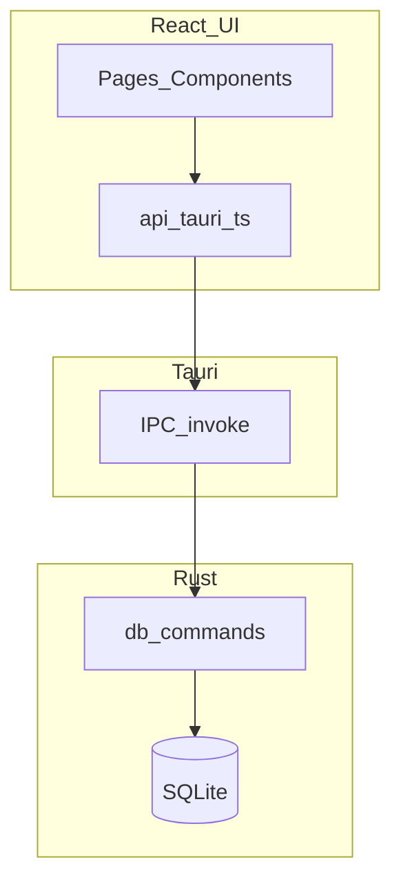

# PrisonSIS-Tauri 项目完整开发计划

## 1. 文档信息

- **产品**：监狱审讯笔录系统（PrisonSIS）桌面客户端（Tauri 版）
- **技术栈**：Tauri 2、Rust、SQLite、React、TypeScript、Vite
- **仓库现状**：UI 壳较完整；Rust 数据层部分实现；多数业务页为 mock/占位
- **文档版本**：v1.0
- **维护方式**：每阶段结束时更新「里程碑」与「范围矩阵/追溯表」

---

## 2. 目标与非目标

### 2.1 产品目标

- 在监管局域环境内完成业务闭环：**服刑人员信息维护 → 笔录起草 → 审批流转 → 检索归档 → 审计留痕**。
- 支持桌面端本地/内网部署：默认本地 SQLite，可控备份与导出。

### 2.2 技术目标

- **桌面端优先**：Windows / Linux（CI 已覆盖）；macOS 作为开发环境支持，发布打包另行规划。
- **契约清晰**：前端 `invoke` API + TypeScript 类型与 Rust `Serialize` 对齐。
- **可维护性**：逐步去 mock；统一错误处理、加载态；减少「点了没反应」的占位交互。

### 2.3 非目标（除非单独立项）

- 纯浏览器 SaaS 多租户（GitHub Pages 仅作 UI 预览）。
- 端到端加密笔录正文、跨站点联邦同步（可作为后续增强）。
- 对接外部统一身份认证/SSO（需单独阶段与环境对接）。

---

## 3. 现状评估（As-Is）

### 3.1 数据库（SQLite）

初始化脚本：`frontend/src-tauri/src/init_db.sql`。

已实现表：`users`、`criminals`、`records`、`templates`、`logs`（含种子用户与测试数据）。

主要缺口：

- **无独立 `cases`（案件）表**：若要做「案件」模块，需要新增表或明确用 `criminals.case_number` 等字段拼装业务规则。

### 3.2 Rust/Tauri Commands（后端）

核心文件：`frontend/src-tauri/src/db.rs`、注册入口：`frontend/src-tauri/src/lib.rs`。

已实现（现状可用）：

- 认证：`login`
- 服刑人员：`get_criminals`、`get_criminals_by_page`、`add_criminal`、`update_criminal`
- 笔录：`get_records`（分页+关键字）、`get_recent_records`
- 仪表盘：`get_dashboard_stats`

主要缺口（影响业务闭环）：

- 笔录缺少 **`add_record` / `update_record` / `get_record_by_id`** 等写入与详情能力。
- `get_records` 缺少按 `status` 的筛选参数，导致与前端「全部/草稿/待审批/已审批」等 Tab 不匹配。
- 用户、模板、日志、审批、导出、备份等模块缺少对应 command。

### 3.3 前端页面与数据来源

页面目录：`frontend/src/pages/`，共 13 个页面：

- `LoginPage`：Tauri 模式调用 `login`；Web 预览可降级模拟登录。
- `HomePage`：Tauri 模式调用 `get_dashboard_stats`、`get_recent_records`；失败降级 mock。
- `CriminalListPage`：Tauri 模式调用 `get_criminals_by_page`。
- 其余（`RecordsPage`、`ApprovalsPage`、`CasesPage`、`ArchivePage`、`StatsPage`、`UsersPage`、`LogsPage` 等）：多数为 mock/占位，部分按钮没有绑定事件。

---

## 4. 高层架构（保持不变）

---

## 5. 工作分解结构（WBS）— 按业务能力

1. **认证与会话**：登录、登出、角色（后续可做页面级权限）
2. **服刑人员**：列表、搜索、分页、详情、新增、编辑、归档策略
3. **笔录**：列表、筛选、新建、编辑、查看、编号规则、状态机（草稿→待审→通过/驳回）
4. **审批**：待办列表、审批动作写回 `records`、可选双人审批字段
5. **案件**：数据模型设计 → migration → API → UI（取决于是否引入独立 `cases` 表）
6. **档案**：归档查询、检索、只读策略
7. **模板**：`templates` 表 CRUD，笔录引用模板
8. **统计**：SQL 聚合与可视化，替换统计页 mock
9. **用户与权限**：用户 CRUD、启用/禁用、角色矩阵
10. **日志与审计**：写入 `logs`、日志查询、关键操作埋点
11. **备份与导出**：DB 文件备份、按需导出（CSV/文本/后续 Word/PDF）
12. **工程化**：打包发布、E2E、README/运维说明与合规备注

---

## 6. 阶段规划与里程碑（推荐）

### 阶段 0 — 工程基线（0.5～1 周）

**目标**：开发体验稳定、构建配置一致、环境文档可复现。

**交付**：

- Tauri/浏览器双模式一致：Vite `base` 区分 Tauri 与 GitHub Pages，`devUrl` 对齐。
- 工程告警收敛：修复明显拼写/无用 import 等（不影响业务但提升可维护性）。
- 输出开发环境与构建说明（建议单独 `docs/DEV_ENV.md`）。
- 明确打包目标：macOS 是否纳入正式发布；`tauri.conf.json` 的 `bundle.targets` 规划。

**验收**：新同事按文档可在 macOS/Windows 跑起 `npm run tauri dev`；Pages 预览不受影响。

### 阶段 1 — 笔录制作 MVP（2～3 周，优先）

**目标**：笔录与数据库完全一致的 CRUD + 列表筛选分页。

**后端（Rust）**：

- 扩展 `get_records`：支持 `status_filter`（空=全部）+ `search` + `page/page_size`，并确保 `COUNT` 与列表一致。
- 新增：
  - `get_record_by_id(id)`
  - `add_record(payload)`：服务端生成 `record_id`（建议 `BL-YYYY-####`），校验 `criminal_id` 存在
  - `update_record(payload)`：最小状态规则（一期可限定仅 `Draft` 可编辑核心字段）

**前端（React）**：

- `RecordsPage` 替换 mock：对接分页、关键字、状态 Tab。
- 新建/查看/编辑：弹层或侧栏表单；保存与错误提示；表格「查看」有实际动作。
- 罪犯选择：复用现有 `get_criminals_by_page` 做搜索选择器（最小可用）。

**验收**：

- Tauri 下：新建后可在列表看到，编辑草稿后内容持久化；筛选/分页/搜索正确。
- `cargo check`、`npm run build` 通过。

### 阶段 2 — 审批中心（1～2 周）

**目标**：待审批队列 + 通过/驳回写回 `records`，首页「待审批」数字真实。

**交付**：

- Rust：`list_pending_records`、`approve_record`、`reject_record`（或通用 `set_record_status`）
- 前端：`ApprovalsPage` 去 mock；联动笔录状态机。
- 审计：审批动作写入 `logs`（最小埋点）。

### 阶段 3 — 案件管理（2～4 周，需需求定稿）

**关键决策**：

- 是否新增 `cases` 表及 `records.case_id` 外键；或使用 `case_number` 字符串关系。

**交付**：migration + API + `CasesPage` 实数据 + 与笔录/罪犯关联视图。

### 阶段 4 — 档案 / 模板 / 导出（2～3 周，可并行）

- 档案：归档筛选与只读（`ArchivePage`）
- 模板：`templates` CRUD（`TemplatesPage`）
- 导出：最小可用先做 CSV/纯文本；Word/PDF 模板作为后续增强

### 阶段 5 — 用户管理、日志审计、备份（2～3 周）

- 用户：CRUD、禁用、重置密码（PBKDF2/兼容旧 MD5）
- 日志：统一写日志封装，LogsPage 分页查询与筛选
- 备份：导出 DB 文件到用户选择路径（带校验/时间戳命名）

### 阶段 6 — 统计与仪表盘深化（1～2 周）

- 扩展 `get_dashboard_stats` 与 `StatsPage`，替换统计页 mock，统一指标口径。

### 阶段 7 — 质量与发布（持续 + 集中 1～2 周）

- 冒烟/回归用例固化（登录→罪犯→笔录→审批）
- E2E（可选 Playwright）或最小自动化脚本
- 版本管理、签名与发布产物说明（Windows/Linux/macOS）

---

## 7. 依赖关系（简化）

- 阶段 1（笔录）是阶段 2（审批）的前置依赖。
- 案件（阶段 3）依赖业务模型决策与 schema/migration。
- 日志审计（阶段 5）依赖全链路埋点约定（哪些操作必须留痕）。

---

## 8. 风险登记册

- **R1：初始化脚本路径**：当前 `db::init` 通过相对路径读取 `src/init_db.sql`，打包或工作目录变化可能导致脚本找不到。\n  - 缓解：改为 `include_str!` 或使用 Tauri 资源路径统一读取。\n- **R2：需求扩展（双人审批、电子签章、正文加密）**：会影响状态机、字段与 UI。\n  - 缓解：一期只做最小状态机与字段不破坏扩展；复杂能力独立阶段。\n- **R3：合规与留痕**：导出、审批、编辑必须可追溯。\n  - 缓解：阶段 5 统一日志；关键操作先做最低限度埋点。\n- **R4：跨平台打包差异**：`bundle.targets` 与平台依赖不同。\n  - 缓解：阶段 0 明确目标平台；按平台补齐配置与 CI 验证。\n+
---

## 9. 测试策略

- **单元测试（Rust）**：编号生成、状态转换、SQL 边界（可用 SQLite 内存库/临时库）。
- **契约测试**：TS `types.ts` 与 Rust struct 字段一致性检查（评审+脚本化检查可选）。
- **集成测试**：关键命令在 Tauri 下可调用并返回预期。
- **回归测试**：固定最小冒烟路径（阶段 1、2 完成后必须执行）。

---

## 10. 沟通与节奏（项目管理）

- **双周迭代**：每迭代明确范围与验收，结束后更新此文档的里程碑与追溯表。
- **需求入口**：每个新需求必须提供「验收标准 + 数据影响 + UI 入口」，防止页面堆叠 mock。
- **变更管理**：跨表结构变更必须带 migration 策略与回滚说明。

---

## 11. 范围-后端-数据追溯表（Backlog 维护）

| 模块 | 页面 | 建议 Rust API（增量） | 数据表 |
|------|------|------------------------|--------|
| 笔录 | RecordsPage | get_records(status+search+page)、get_record_by_id、add_record、update_record | records, criminals |
| 审批 | ApprovalsPage | list_pending、approve、reject / set_status | records, logs |
| 案件 | CasesPage | cases CRUD、关联查询 | cases（待建）, records, criminals |
| 档案 | ArchivePage | archived 查询、归档动作 | criminals, records |
| 模板 | TemplatesPage | templates CRUD | templates |
| 统计 | StatsPage | 聚合 queries | 多表 |
| 用户 | UsersPage | users CRUD、reset_password、enable/disable | users |
| 日志 | LogsPage | logs 分页查询、写入封装 | logs |
| 备份 | BackupPage | export_db、import_db（可选） | SQLite 文件 |

---

## 12. 第一阶段（笔录 MVP）详细交付清单（用于启动执行）

### 后端

- [ ] `get_records` 增加 `status_filter`（可选）并保证 `COUNT`/列表一致
- [ ] `get_record_by_id(id)`
- [ ] `add_record(payload)`（服务端生成 `record_id`）
- [ ] `update_record(payload)`（一期最小状态校验）
- [ ] 在 `lib.rs` 注册新 command

### 前端

- [ ] `api/tauri.ts` 增加对应调用与类型对齐
- [ ] `RecordsPage` 去 mock：分页/搜索/Tab/加载态/错误态
- [ ] 新建/查看/编辑 UI（最小可用）
- [ ] 罪犯选择器（复用 `get_criminals_by_page`）

### 验收

- [ ] 新建草稿 → 列表可见 → 编辑保存 → 重启应用仍存在
- [ ] Tab（Draft/Pending/Approved）筛选正确
- [ ] 关键字搜索与分页正确

