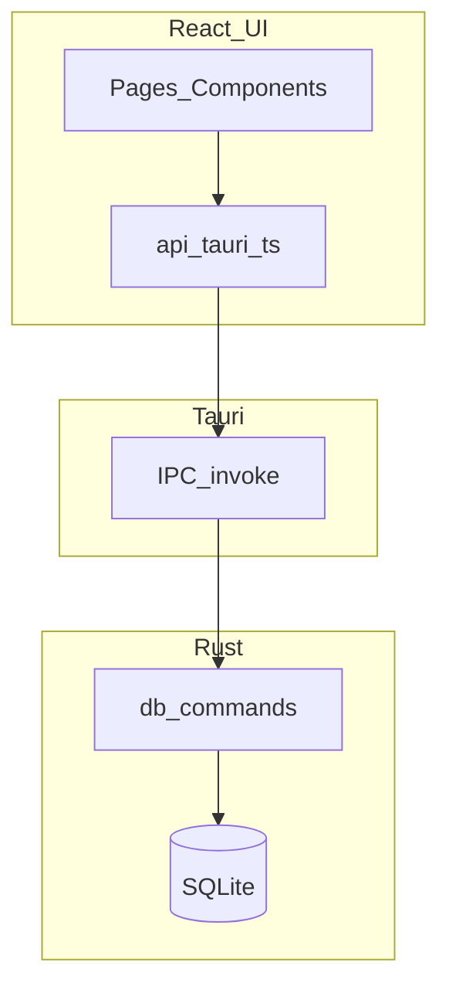

# PrisonSIS-Tauri 项目完整开发计划

## 1. 文档信息

- **产品**：监狱审讯笔录系统（PrisonSIS）桌面客户端（Tauri 版）
- **技术栈**：Tauri 2、Rust、SQLite、React、TypeScript、Vite
- **仓库现状**：UI 壳较完整；Rust 数据层部分实现；多数业务页为 mock/占位
- **文档版本**：v1.7（见 §20 修订记录）
- **维护方式**：每阶段结束时更新「里程碑」与「范围矩阵/追溯表」

---

## 2. 目标与非目标

### 2.1 产品目标

- 在监管局域环境内完成业务闭环：**服刑人员信息维护 → 笔录起草 → 审批流转 → 检索归档 → 审计留痕**。
- 支持桌面端本地/内网部署：默认本地 SQLite，可控备份与导出。

### 2.2 技术目标

- **桌面端优先**：Windows / Linux（CI 已覆盖）；macOS 作为开发环境支持，发布打包另行规划。
- **契约清晰**：前端 `invoke` API + TypeScript 类型与 Rust `Serialize` 对齐。
- **可维护性**：逐步去 mock；统一错误处理、加载态；减少「点了没反应」的占位交互。

### 2.3 非目标（除非单独立项）

- 纯浏览器 SaaS 多租户（GitHub Pages 仅作 UI 预览）。
- 端到端加密笔录正文、跨站点联邦同步（可作为后续增强）。
- 对接外部统一身份认证/SSO（需单独阶段与环境对接）。

---

## 3. 现状评估（As-Is）

### 3.1 数据库（SQLite）

初始化脚本：`frontend/src-tauri/src/init_db.sql`。

已实现表：`users`、`criminals`、`records`、`templates`、`logs`（含种子用户与测试数据）。

主要缺口（阶段 3 将补齐）：

- **已拍板**：新建 **`cases`（案件）表**，并在 **`records` 上增加 `case_id` 外键**（可空，兼容历史数据）。不再采用「仅用 `case_number` 字符串替代案件主表」作为阶段 3 主方案；`criminals.case_number` 等字段可与 `cases.case_number` 并存或逐步对齐，以实现为准。

### 3.2 Rust/Tauri Commands（后端）

核心文件：`frontend/src-tauri/src/db.rs`、注册入口：`frontend/src-tauri/src/lib.rs`。

已实现（现状可用）：

- 认证：`login`
- 服刑人员：`get_criminals`、`get_criminals_by_page`、`add_criminal`、`update_criminal`
- 笔录：`get_records`（分页+关键字）、`get_recent_records`
- 仪表盘：`get_dashboard_stats`

主要缺口（影响业务闭环）：

- 笔录缺少 **`add_record` / `update_record` / `get_record_by_id`** 等写入与详情能力。
- `get_records` 缺少按 `status` 的筛选参数，导致与前端「全部/草稿/待审批/已审批」等 Tab 不匹配。
- 用户、模板、日志、审批、导出、备份等模块缺少对应 command。

### 3.3 前端页面与数据来源

页面目录：`frontend/src/pages/`，共 13 个页面：

- `LoginPage`：Tauri 模式调用 `login`；Web 预览可降级模拟登录。
- `HomePage`：Tauri 模式调用 `get_dashboard_stats`、`get_recent_records`；失败降级 mock。
- `CriminalListPage`：Tauri 模式调用 `get_criminals_by_page`。
- 其余（`RecordsPage`、`ApprovalsPage`、`CasesPage`、`ArchivePage`、`StatsPage`、`UsersPage`、`LogsPage` 等）：多数为 mock/占位，部分按钮没有绑定事件。

---

## 4. 高层架构（保持不变）

---

## 5. 工作分解结构（WBS）— 按业务能力

1. **认证与会话**：登录、登出、角色（后续可做页面级权限）
2. **服刑人员**：列表、搜索、分页、详情、新增、编辑、归档策略
3. **笔录**：列表、筛选、新建、编辑、查看、编号规则、状态机（草稿→待审→通过/驳回）
4. **审批**：待办列表、审批动作写回 `records`、可选双人审批字段
5. **案件**：数据模型设计 → migration → API → UI（取决于是否引入独立 `cases` 表）
6. **档案**：归档查询、检索、只读策略
7. **模板**：`templates` 表 CRUD，笔录引用模板
8. **统计**：SQL 聚合与可视化，替换统计页 mock
9. **用户与权限**：用户 CRUD、启用/禁用、角色矩阵
10. **日志与审计**：写入 `logs`、日志查询、关键操作埋点
11. **备份与导出**：DB 文件备份、按需导出（CSV/文本/后续 Word/PDF）
12. **工程化**：打包发布、E2E、README/运维说明与合规备注

---

## 6. 阶段规划与里程碑（推荐）

### 阶段 0 — 工程基线（0.5～1 周）

**目标**：开发体验稳定、构建配置一致、环境文档可复现。

**交付**：

- Tauri/浏览器双模式一致：Vite `base` 区分 Tauri 与 GitHub Pages，`devUrl` 对齐。
- 工程告警收敛：修复明显拼写/无用 import 等（不影响业务但提升可维护性）。
- 输出开发环境与构建说明（建议单独 `docs/DEV_ENV.md`）。
- 明确打包目标：macOS 是否纳入正式发布；`tauri.conf.json` 的 `bundle.targets` 规划。
- **数据库脚本加载可靠化**：将 `init_db.sql` 从「运行时依赖工作目录」改为 `include_str!` 或嵌入 Tauri resource，并在阶段小结中列出验收项（见 §8-R1）。

**验收**：新同事按文档可在 macOS/Windows 跑起 `npm run tauri dev`；Pages 预览不受影响。

### 阶段 1 — 笔录制作 MVP（2～3 周，优先）

**目标**：笔录与数据库完全一致的 CRUD + 列表筛选分页。

**后端（Rust）**：

- 扩展 `get_records`：支持 `status_filter`（空=全部）+ `search` + `page/page_size`，并确保 `COUNT` 与列表一致。
- 新增：
  - `get_record_by_id(id)`
  - `add_record(payload)`：服务端生成 `record_id`（建议 `BL-YYYY-####`），校验 `criminal_id` 存在
  - `update_record(payload)`：最小状态规则（一期可限定仅 `Draft` 可编辑核心字段）

**前端（React）**：

- `RecordsPage` 替换 mock：对接分页、关键字、状态 Tab。
- 新建/查看/编辑：弹层或侧栏表单；保存与错误提示；表格「查看」有实际动作。
- 罪犯选择：复用现有 `get_criminals_by_page` 做搜索选择器（最小可用）。

**验收**：

- Tauri 下：新建后可在列表看到，编辑草稿后内容持久化；筛选/分页/搜索正确。
- `cargo check`、`npm run build` 通过。

### 阶段 2 — 审批中心（1～2 周）

**目标**：待审批队列 + 通过/驳回写回 `records`，首页「待审批」数字真实。

**产品约定（一期，已拍板）**：

- **提交待审入口**：在笔录编辑弹层（`record-modal`）内使用**单独按钮**「**提交审批**」，与「保存」分立；先保存再提交或提交前自动校验必填字段等实现细节由开发定，但入口必须是独立操作。
- **驳回**：**必须填写驳回理由**；`reject_reason` 不允许空字符串；前端拦截 + 后端 `reject_record`（或等价 command）再次校验。
- **审批人身份**：当前登录态仍弱；`logs` 中操作者可记**占位**（如空、`system` 或固定文案），待会话/用户体系补强后再写入真实 `user_id` 或用户名。

**交付**：

- Rust：`list_pending_records`、`approve_record`、`reject_record`（或通用 `set_record_status`）；`submit_record_for_approval`（或等价：仅 `Draft` → `Pending`）
- 前端：`RecordsPage` 弹层增加「提交审批」；`ApprovalsPage` 去 mock；驳回理由表单校验；联动笔录状态机。
- 审计：审批动作写入 `logs`（最小埋点，含占位操作者策略）。

### 阶段 3 — 案件管理（2～4 周）

**数据模型（已拍板）**：

- 新建表 **`cases`（一期最小列，已定稿）**：  
  - `id`：`INTEGER PRIMARY KEY AUTOINCREMENT`  
  - `case_number`：`TEXT NOT NULL UNIQUE`（业务案号）  
  - `title`：`TEXT NOT NULL DEFAULT ''`（标题/简要说明）  
  - `status`：`TEXT NOT NULL DEFAULT 'open'`（建议取值：`open` 在办、`closed` 结案、`archived` 归档；UI 以下拉约束为佳）  
  - `remark`：`TEXT`（备注，可空）  
  - `created_at`：`TEXT DEFAULT (datetime('now','localtime'))`  
  - `updated_at`：`TEXT DEFAULT (datetime('now','localtime'))`（新建与每次编辑时刷新）  
  二期如需立案日、承办单位、法院文书号等，经评审后 **migration 加列**，本期不扩展必填字段。
- **`records.case_id`**：`INTEGER` 可空，**外键引用 `cases(id)`**，并写明 **`ON DELETE RESTRICT`**：仍有笔录关联时不允许删除该案件行；与「一期不对 `cases` 做物理删除、仅归档/停用」的产品策略一致。
- **笔录 `case_id` 写入规则**：**仅 `Draft`（草稿）** 状态下允许写入、修改或清空 **`case_id`**（与阶段 1「仅草稿可编辑核心字段」一致）。非草稿一律由 **后端拒绝**；`RecordsPage` 在非草稿弹层中不提供案件选择器或保持只读。
- **旧库升级**：现有 `records` 行 `case_id` 默认为 `NULL`；可选提供「按案号批量关联」工具或留待人工在 UI 中补挂（非必须 blocking）。

**后端（Rust）**：

- `cases` 的 **列表分页 + 关键字**、**按 id 查询**、**新增 / 更新**；删除策略：**一期可禁止物理删除**，仅「停用/归档」或不做删除按钮。
- **关联查询**：按案件拉取关联 **笔录列表**（只读摘要即可）；按案件查看已关联 **服刑人员**（若仅通过 `records` 间接关联，可先实现「本案涉及人员 = 关联笔录中的 distinct criminal」）。
- 在 `lib.rs` 注册 command；`Record` / `RecordInput` 等结构体扩展 `case_id`（可空）并与 TS 对齐；**`update_record`（或等价路径）在非草稿时不得接受对 `case_id` 的变更**。
- **审计（可选）**：案件 **新建 / 更新**（及归档类状态变更若实现）可写入 **`logs`**，`action` 可约定如 `case_create`、`case_update`；`user_id` 占位策略与阶段 2 一致（弱登录态下可用 `system`）。

**前端（React）**：

- **`CasesPage` 去 mock**：列表、搜索、新建/编辑案件、详情（含关联笔录列表或跳转入口）。
- **`RecordsPage`**：**草稿编辑**弹层内 **可选案件**（下拉或搜索选择 `cases`）；保存时带上 `case_id`；非草稿仅展示关联信息不可改；列表可增加「案号/案件」列（展示 `case_number` 或标题，以后端 join 或二次查询为准）。

**迁移与工程**：

- 按 §15 约定：表结构变更需 **migration 版本号 + 升级脚本**；重大变更前提示备份。
- 验收见 **§12.2**；`cargo check`、`npm run build` 通过。

### 阶段 4 — 档案 / 模板 / 导出（2～3 周，可并行）

**目标**：完成「归档可查可管、模板可维护、导出可落地」的最小业务闭环，替换相关页面 mock/占位能力。

**后端（Rust）**：

- **档案（Archive）**  
  - 增加归档查询 command：支持分页、关键字、归档状态筛选（至少覆盖服刑人员维度）。  
  - 增加归档动作 command：按业务约定将目标标记为归档（建议优先软归档，不做物理删除）。  
  - 归档后的只读约束：对归档对象的核心编辑接口在后端拒绝（与前端只读配合，后端兜底）。
- **模板（Templates）**  
  - `templates` 最小 CRUD：列表分页/搜索、详情（可选）、新增、编辑、删除（或停用）。  
  - 模板名称/分类等基础校验（空值、重复策略按实现约定，但需有明确错误返回）。
- **导出（Export）**  
  - 最小导出 command：按筛选条件导出 CSV（可附带纯文本导出）。  
  - 输出字段、时间格式、文件命名规则固化（建议 `模块-日期时间.csv`）。  
  - I/O 异常可读错误返回（路径无权限、写入失败等）。

**阶段 4 最小 API 清单（建议命名，可按实现微调）**：

- **Archive（仅 `criminals` 归档）**
  - `get_archive_criminals_by_page(page, page_size, search, archived_filter) -> (Vec<Criminal>, i64)`  
    - `archived_filter`：`'' | 'archived' | 'active'`（或等价约定）。
  - `archive_criminal(id: i64) -> ()`  
    - 行为：将 `criminals.archived` 置为 `1`。
  - `unarchive_criminal(id: i64) -> ()`  
    - 行为：将 `criminals.archived` 置为 `0`（阶段 4 已确认支持取消归档）。
- **Templates（软删）**
  - `get_templates_by_page(page, page_size, search, include_disabled) -> (Vec<Template>, i64)`  
    - `include_disabled`：是否包含已停用模板。
  - `get_template_by_id(id: i64) -> Template`（可选，但建议保留便于详情/编辑回填）。
  - `add_template(input: TemplateInput) -> Template`
  - `update_template(input: Template) -> ()`
  - `disable_template(id: i64) -> ()`  
    - 行为：软删/停用（写入 `deleted_at`）；允许停用被历史笔录引用的模板。
- **Export（系统文件选择器 + 同名覆盖）**
  - `export_records_csv(filter: ExportRecordFilter, file_path: String) -> ExportResult`  
    - 行为：按筛选导出；若 `file_path` 已存在同名文件，允许覆盖。
  - `export_records_txt(filter: ExportRecordFilter, file_path: String) -> ExportResult`（若本期做纯文本导出）。
  - `pick_export_path(default_file_name: String, extension: String) -> Option<String>`（可选）  
    - 说明：若路径选择在前端完成，可不提供此 command，由前端直接调系统文件选择器 API。

**前端（React）**：

- **`ArchivePage` 去 mock**：接后端真实分页/筛选；提供归档入口（若范围允许）与只读展示。  
- **`TemplatesPage` 去 mock**：列表、搜索、新增/编辑/删除（或停用）完整链路。  
- **`ExportPage` 去 mock**：导出条件表单 + 触发导出 + 成功/失败反馈；明确「保存位置/文件名」提示。  
- 统一错误提示：避免 `[object Object]`，异常信息可读化（沿用现有错误格式化策略）。

**数据与合规约定（阶段 4 内定稿）**：

- 导出字段是否脱敏（身份证号、联系方式）必须给出一期结论（脱敏/不脱敏/按角色）。  
- **归档对象范围（已定）**：一期仅归档 **`criminals`**（如 `criminals.archived=1`）；`records` 不新增独立归档状态。  
- **回滚策略（已定）**：支持取消归档（`criminals.archived` 可从 1 恢复为 0）。
- **导出保存机制（已定）**：使用系统文件选择器；同名文件允许覆盖。
- **模板删除语义（已定）**：采用软删/停用；即使被历史笔录引用仍允许删除（历史笔录保留原始内容与关联展示能力）。
- **模板软删字段（已定）**：使用 `deleted_at`（`NULL` 表示启用，非 `NULL` 表示停用/已删除）。
- **取消归档权限（已定）**：仅管理员可执行取消归档；非管理员由后端拒绝。
- **导出字段清单（已定，CSV）**：  
  1) `笔录编号(record_id)`  
  2) `案件案号(case_number)`  
  3) `服刑人员编号(criminal_code)`（映射 `criminals.criminal_id`）  
  4) `服刑人员姓名(criminal_name)`  
  5) `笔录类型(record_type)`  
  6) `状态(status)`  
  7) `谈话时间(record_date)`  
  8) `谈话地点(record_location)`  
  9) `谈话人(interrogator_id)`  
  10) `记录人(recorder_id)`  
  11) `创建时间(created_at)`  
  12) `驳回理由(reject_reason)`  
- **导出时间格式（已定）**：统一 `YYYY-MM-DD HH:mm:ss`（本地时区）。  
- **CSV 编码（已定）**：UTF-8 with BOM（保证 Excel 打开中文不乱码）。

**工程**：

- `cargo check`（`frontend/src-tauri`）与 `npm run build`（`frontend`）通过。  
- 阶段 1～3 冒烟路径不回归（登录→笔录→审批→案件）。

### 阶段 5 — 用户管理、日志审计、备份（2～3 周）

- 用户：CRUD、禁用、重置密码（PBKDF2/兼容旧 MD5）
- 日志：统一写日志封装，LogsPage 分页查询与筛选
- 备份：导出 DB 文件到用户选择路径（带校验/时间戳命名）

### 阶段 6 — 统计与仪表盘深化（1～2 周）

- 扩展 `get_dashboard_stats` 与 `StatsPage`，替换统计页 mock，统一指标口径。

### 阶段 7 — 质量与发布（持续 + 集中 1～2 周）

- 冒烟/回归用例固化（登录→罪犯→笔录→审批）
- E2E（可选 Playwright）或最小自动化脚本
- 版本管理、签名与发布产物说明（Windows/Linux/macOS）

---

## 7. 依赖关系（简化）

- 阶段 1（笔录）是阶段 2（审批）的前置依赖。
- 案件（阶段 3）依赖 **`cases` 表 + `records.case_id` 的 schema/migration** 与 `CasesPage` 联调（模型已拍板，见 §6 阶段 3）。
- 日志审计（阶段 5）依赖全链路埋点约定（哪些操作必须留痕）。

---

## 8. 风险登记册

| ID | 风险 | 缓解 |
|----|------|------|
| R1 | `db::init` 依赖相对路径读取 `init_db.sql`，打包或工作目录变化可能导致脚本找不到 | 阶段 0 落地 `include_str!` 或 Tauri resource 路径；发布后做一次「干净目录启动」冒烟 |
| R2 | 需求扩展（双人审批、电子签章、正文加密）挤占工期 | 一期最小状态机 + 预留字段；扩展能力单列阶段与验收 |
| R3 | 合规与留痕不足（导出/审批/改稿不可追溯） | 阶段 5 统一日志 API；审批与导出必埋点后再开放给生产 |
| R4 | 跨平台打包与 CI 产物不一致（Windows/Linux/macOS） | 阶段 0 锁定「正式发布平台矩阵」；CI 与各平台冒烟清单对齐 |
| R5 | 敏感数据残留于日志或错误弹窗（堆栈带出正文） | 统一错误对用户展示文案；Rust `log::` 对 `content` 打码或禁止整段打印 |

---

## 9. 测试策略

- **单元测试（Rust）**：编号生成、状态转换、SQL 边界（可用 SQLite 内存库/临时库）。
- **契约测试**：TS `types.ts` 与 Rust struct 字段一致性检查（评审+脚本化检查可选）。
- **集成测试**：关键命令在 Tauri 下可调用并返回预期。
- **回归测试**：固定最小冒烟路径（阶段 1、2 完成后必须执行）。

---

## 10. 沟通与节奏（项目管理）

- **双周迭代**：每迭代明确范围与验收，结束后更新此文档的里程碑与追溯表。
- **需求入口**：每个新需求必须提供「验收标准 + 数据影响 + UI 入口」，防止页面堆叠 mock。
- **变更管理**：跨表结构变更必须带 migration 策略与回滚说明。

---

## 11. 范围-后端-数据追溯表（Backlog 维护）

| 模块 | 页面 | 建议 Rust API（增量） | 数据表 |
|------|------|------------------------|--------|
| 笔录 | RecordsPage | get_records(status+search+page)、get_record_by_id、add_record、update_record | records, criminals |
| 审批 | ApprovalsPage | list_pending、approve、reject / set_status | records, logs |
| 案件 | CasesPage | cases CRUD、分页搜索、关联笔录/人员查询 | **cases（新建）**, records（**+case_id FK**）, criminals |
| 档案 | ArchivePage | archived 查询、归档动作 | criminals, records |
| 模板 | TemplatesPage | templates CRUD | templates |
| 导出 | ExportPage | export_records_csv（举例）、按需 export_pdf/word（后置） | records, criminals |
| 统计 | StatsPage | 聚合 queries | 多表 |
| 用户 | UsersPage | users CRUD、reset_password、enable/disable | users |
| 日志 | LogsPage | logs 分页查询、写入封装 | logs |
| 备份 | BackupPage | export_db、import_db（可选） | SQLite 文件 |

---

## 12. 第一阶段（笔录 MVP）详细交付清单（用于启动执行）

### 后端

- [x] `get_records` 增加 `status_filter`（可选）并保证 `COUNT`/列表一致
- [x] `get_record_by_id(id)`
- [x] `add_record(payload)`（服务端生成 `record_id`）
- [x] `update_record(payload)`（一期最小状态校验：`Draft` 可编辑）
- [x] 在 `lib.rs` 注册新 command

### 前端

- [x] `api/tauri.ts` 增加对应调用与类型对齐
- [x] `RecordsPage` 去 mock：分页/搜索/Tab/加载态/错误态
- [x] 新建/查看/编辑 UI（最小可用）
- [x] 罪犯选择器（复用 `get_criminals_by_page`）

### 验收（请在本机 `npm run tauri dev` 自测勾选）

- [ ] 新建草稿 → 列表可见 → 编辑保存 → 重启应用仍存在
- [ ] Tab（含 Draft/Pending/Approved/Rejected）筛选正确
- [ ] 关键字搜索与分页正确

---

## 12.1 第二阶段（审批中心）— 验收（本机自测勾选）

> **草案说明**：开发前可作范围与 DoD 参照；与 §6「阶段 2 — 产品约定」冲突时以 §6 为准。**阶段 2 结案前**请对照本节逐项勾选，并与 §13.3 摘要一致。

**环境**：本机 `npm run tauri dev`；数据库中至少有一条可提交的**草稿**笔录（阶段 1 能力）。

### 流程与数据

- [ ] **提交待审**：在笔录**编辑弹层**内点击单独按钮「**提交审批**」（与「保存」分立），将 `Draft` 转为 `Pending`。提交后该条在 `RecordsPage` 的「待审批」Tab 中可见，且**不再**按草稿规则编辑核心字段（与后端校验一致）。
- [ ] **待审列表**：`ApprovalsPage` 展示的数据来自后端（非 mock），待审批区仅含（或明确区分）`status = Pending` 的笔录；列表字段（编号、服刑人员、类型、提交时间等）与库中一致。
- [ ] **通过**：对一条待审记录执行「通过」后，其状态变为 `Approved`；`RecordsPage` 列表与 Tab「已审批」中可见；该条从审批中心「待审批」列表消失。
- [ ] **驳回**：对一条待审记录执行「驳回」时**必须填写理由**；仅空格视为无效（与「不允许空字符串」一致）；`reject_reason` 持久化。状态变为 `Rejected`；笔录列表 Tab「已驳回」中可见；待审列表中消失。故意提交空理由时前端拒绝且后端返回错误。
- [ ] **非法操作**：对非 `Pending` 记录调用审批接口（若 UI 已隐藏按钮，可用临时手段或仅依赖后端）时，后端**拒绝**并返回明确错误，不篡改状态。

### 首页与一致性

- [ ] **待审批数量**：首页「待审批」卡片数字与库中 `status = 'Pending'` 的条数一致；完成一次「通过」或「驳回」后，**刷新或重新进入首页**（以实现为准）后数字相应减少。
- [ ] **与阶段 1 衔接**：仍处于 `Draft` 的笔录行为与阶段 1 一致；已 `Approved` / `Rejected` 的编辑限制与当前 `update_record` 规则一致。

### 审计（最小）

- [ ] **日志埋点**：每次「通过」「驳回」在 `logs` 表中有可追溯记录（至少含操作类型、目标笔录标识、时间）。**审批人身份**：当前登录态弱，操作者字段允许占位（与 §6 约定一致），后续再接真实用户标识。

### 工程

- [ ] `cargo check`（`frontend/src-tauri`）通过。
- [ ] `npm run build`（`frontend`）通过。

---

## 12.2 第三阶段（案件管理，`cases` 表）— 验收（本机自测勾选）

> **草案说明**：与 §6「阶段 3」冲突时以 §6 为准；字段名与 command 命名以实现为准。**阶段 3 结案前**逐项勾选。

**环境**：本机 `npm run tauri dev`；数据库已执行含 **`cases` 与 `records.case_id`** 的 migration / 新装库脚本。

### 数据与迁移

- [ ] 新装库：`init_db.sql`（或等价脚本）含 **`cases` 表** 与 **`records.case_id`** 外键定义（**`ON DELETE RESTRICT`**），应用可正常启动。
- [ ] 旧库升级：在已有数据上执行 migration 后 **`records` 不丢**，原有行 `case_id` 可为 `NULL`；无未处理致命错误。

### 案件 CRUD 与页面

- [ ] **新建案件**：`CasesPage` 创建一条案件，**案号唯一**；保存后列表可见，重启应用仍在。
- [ ] **编辑案件**：修改标题/状态等约定字段后持久化正确。
- [ ] **列表/搜索**：分页与关键字（案号/标题等）行为正确。
- [ ] **详情/关联**：打开案件详情可看到 **关联笔录**（或跳转笔录列表并带筛选）；涉及 **服刑人员** 的展示与业务规则一致（以实现为准）。

### 笔录关联

- [ ] **RecordsPage**：**仅草稿**编辑时可 **关联 / 修改 / 解除** 案件；保存后 `case_id` 写入库；再次打开显示一致。
- [ ] **非草稿不写 `case_id`**：`Pending` / `Approved` / `Rejected` 下 **不可** 在 UI 中改关联案件，且后端对仅变更 `case_id`（或携带非法 `case_id`）的更新 **拒绝**。
- [ ] **解除或改挂**（若一期支持）：行为符合约定且不破坏外键约束。

### 一致性与工程

- [ ] 非法外键（不存在的 `case_id`）由 **后端拒绝** 并提示。
- [ ] **`ON DELETE RESTRICT`**：存在笔录 `case_id` 指向某案件时，对该 **`cases` 行执行 DELETE**（调试或管理入口若存在）应 **失败**（数据库或应用层任一即可验证）；日常应以归档代替物理删除。
- [ ] `cargo check`、`npm run build` 通过。

### 审计（可选）

- [ ] （可选）案件 **新建 / 编辑**（及归档状态变更若实现）在 **`logs`** 中有可追溯记录（`action` + 目标案件标识 + 时间；操作者占位同阶段 2）。

---

## 12.3 第四阶段（档案 / 模板 / 导出）— 验收（本机自测勾选）

> **草案说明**：与 §6「阶段 4」冲突时以 §6 为准；字段名与 command 命名以实现为准。**阶段 4 结案前**逐项勾选。

**环境**：本机 `npm run tauri dev`；数据库已有可用于归档、模板维护与导出的样本数据。

### 档案（ArchivePage）

- [ ] **列表去 mock**：档案列表来自后端，分页与关键字检索正确。  
- [ ] **归档筛选**：归档/未归档（或等价状态）筛选结果与数据库一致。  
- [ ] **归档动作**（若本期实现）：执行后状态持久化，重启应用后仍正确。  
- [ ] **只读约束**：归档对象在 UI 中不可编辑；若绕过 UI 调编辑 command，后端拒绝。
- [ ] **取消归档**：可将归档对象恢复为未归档；恢复后列表、筛选与编辑权限联动正确。
- [ ] **取消归档权限**：仅管理员可执行取消归档；非管理员在 UI 与后端命令层均被拒绝。

### 模板（TemplatesPage）

- [ ] **列表/搜索去 mock**：模板列表、关键字查询、分页正确。  
- [ ] **新建模板**：必填校验有效；保存后列表可见，重启后仍在。  
- [ ] **编辑模板**：内容更新后持久化正确，并可被笔录页模板选择器读取。  
- [ ] **删除/停用模板（软删）**：被历史笔录引用的模板也可删除（停用），且历史笔录显示不受破坏；失败时提示可读。

### 导出（ExportPage）

- [ ] **导出能力可用**：可导出 CSV（和/或纯文本），文件实际生成成功。  
- [ ] **筛选一致性**：导出结果与当前筛选条件一致（状态/时间/关键字等）。  
- [ ] **编码与可读性**：中文在常用工具（如 Excel）打开不乱码（按实现约定验证）。  
- [ ] **异常处理**：路径不可写、写入失败等场景有明确错误提示，不出现无意义报错对象。
- [ ] **文件保存行为**：通过系统文件选择器选择路径；选择已存在同名文件时允许覆盖并符合预期。
- [ ] **列定义一致性**：CSV 列名、列顺序与 §6「导出字段清单（已定）」完全一致。  
- [ ] **时间格式一致性**：`record_date/created_at` 导出为 `YYYY-MM-DD HH:mm:ss`（本地时区）。  
- [ ] **编码一致性**：CSV 文件编码为 UTF-8 with BOM。

### 合规与工程

- [ ] **导出脱敏策略**：已在阶段内定稿并按策略验证（脱敏/不脱敏/角色控制）。  
- [ ] `cargo check`（`frontend/src-tauri`）通过。  
- [ ] `npm run build`（`frontend`）通过。  
- [ ] 阶段 1～3 核心流程回归通过（登录、笔录、审批、案件关联）。

---

## 13. 需求与用户验收（建议附录形态）

本节用于对内排期或与业务方对齐时引用；具体条文可拆到独立文档并在此挂链接。

### 13.1 每条需求的最低信息（需求入口门禁）

- **业务叙述**：谁在什么场景下要完成什么。
- **数据影响**：是否改表 / 新建 command / 只改 UI。
- **验收标准**：可勾选、可复查（示例见下）。
- **非目标**：本需求明确不包含什么，防止范围漂移。

### 13.2 验收描述模板（可拷贝）

- **Given** 当前用户角色为 `{角色}`，且数据库中存在 `{前置数据}`，
- **When** 用户在 `{页面}` 执行 `{操作}`，
- **Then** `{可观察结果}`（含 DB/API 层面的持久化或可查询结果）。

### 13.3 与各阶段的映射（摘要）

| 阶段 | 建议固化验收包 |
|------|----------------|
| 阶段 1 | 笔录列表/筛选/分页/新建草稿/编辑保存/重启后仍在 |
| 阶段 2 | 待审批列表、通过/驳回后状态与首页统计一致、日志有审批记录 |
| 阶段 3 | `cases` 表 + `records.case_id`、CasesPage 实数据、笔录可选关联案件、迁移与 §12.2 勾选 |
| 阶段 4 | Archive/Templates/Export 去 mock、归档只读与模板 CRUD、导出可用与 §12.3 勾选 |
| 阶段 5 | 管理员可禁用账户、重置密码生效、导出/备份含审计或由日志证明 |

---

## 14. 安全、合规与权限（占位）

本节在实现前可先采用「占位矩阵」，迭代中逐步填空。

### 14.1 角色建议（可按机构调整）

- **Admin**：用户管理、备份、策略类配置。
- **User**：日常录入笔录、发起审批。
- **Approver**：审批中心操作。
- （可选）**Auditor**：只读日志与导出审计。

### 14.2 权限矩阵（页面 × 操作）

用表格维护：`登录 / 查看列表 / 新建 / 编辑 / 审批 / 导出 / 备份 / 用户管理`。实现方式可为：Rust command 层校验角色 + UI 按钮按角色隐藏（**隐藏不等于安全**，服务端命令必须兜底拒绝）。

### 14.3 数据与密钥

- 默认密码哈希策略以现有 Rust 为准；新用户必须走 PBKDF2 路径，逐步淘汰明文 MD5 示例数据（若生产使用）。
- 导出内容是否脱敏（身份证号等）须在阶段 4/5 定稿。
- CSP、文件访问（附件/照片路径）在引入上传或导出时单列安全评审。

---

## 15. 数据治理与迁移策略

- **现状**：初始化依赖 `init_db.sql` 一次性脚本；尚无显式 migration 编号体系。
- **目标**：任一表结构变更必须带 **migration 版本号 + 升级脚本 + 回滚说明（或备份恢复预案）**。
- **兼容性**：新版本客户端启动时对旧库的检测与渐进升级（例如在 `setup` 中执行 `_migrations` 表）。
- **备份**：重大 migration 前自动提示用户备份（与阶段 5 备份功能打通）。

---

## 16. 性能、检索与容量

- **量级假设**：在项目启动时写入「目标」——例如单笔录正文上限、五年内预期 `records` 行数，用于决定是否引入 **SQLite FTS（全文检索）** 或对 `content` 做摘要索引。
- **分页**：所有列表接口强制分页；默认 `page_size` 上限。
- **索引**：随查询模式增补复合索引（如 `status + created_at`）；变更前列出 EXPLAIN QUERY PLAN 抽样。

---

## 17. 无障碍与本地化

- **无障碍**：键盘可达性（表单与弹窗焦点）、对比度、`user-select`/只读场景的可用性（监管场景常见于长时间阅览）。
- **本地化**：当前以 **简体中文**为主；若需维汉等双语，将 i18n 工具与文案抽取列为独立迭代，避免零散硬编码扩散。

---

## 18. 运维发布与 CI 对齐

- **流水线**：与本仓库 `.github/workflows`（构建 release、Pages 预览）对齐；明确「哪些是正式安装包」「哪些是静态演示」。
- **发布清单示例**：版本号、`tauri.conf.json`/`Cargo.toml` 一致、changelog、Smoke、回滚备份说明。
- **macOS**：若纳入正式发布，补足 `bundle` 目标、签名/notarization 策略（可列为阶段 7 子任务）。
- **自动更新**：若未来需要 updater，单列阶段（与安全、签名捆绑）。

---

## 19. 培训、试运行与知识转移

- **操作手册**：管理员（备份/账户）与经办人（笔录/审批）分册或分章节。
- **试运行**：建议固定周期内收集缺陷分级（阻塞/严重/一般），再进「发布冻结」。
- **知识转移**：Rust 指令清单、数据库路径（`PRISONSIS_DB` 环境变量约定）、常见问题（白屏、`init_db.sql`）。

---

## 20. 文档版本与修订记录

| 版本 | 日期 | 修订摘要 |
|------|------|----------|
| v1.0 | （首次落盘） | 初版主计划 |
| v1.1 | （本轮） | 修正 §8 格式；增补 §13～§19 附录维度；§11 补导出行；§0 补 DB 脚本可靠化 |
| v1.2 | 2026-05 | 新增 §12.1「阶段 2 验收（本机自测勾选）」草案 |
| v1.3 | 2026-05 | 阶段 2 产品约定：提交审批独立按钮、驳回理由必填、审批人 logs 占位 |
| v1.4 | 2026-05 | 阶段 3 拍板：`cases` 表 + `records.case_id`；扩充 §6 交付；新增 §12.2 验收；§13.3 补阶段 3；§3.1 更新 |
| v1.5 | 2026-05 | 阶段 3：`records.case_id → cases(id)` 外键定为 **ON DELETE RESTRICT** |
| v1.6 | 2026-05 | 阶段 3：仅 Draft 可写 `case_id`；§12.2 增补 RESTRICT 删除与非草稿校验；可选案件 logs |
| v1.7 | 2026-05 | 阶段 3：`cases` 一期 **最小表**列清单定稿（§6） |

**维护约定**：任一阶段结案时更新 §6 里程碑完成度、§11 追溯表状态及本修订记录表。
