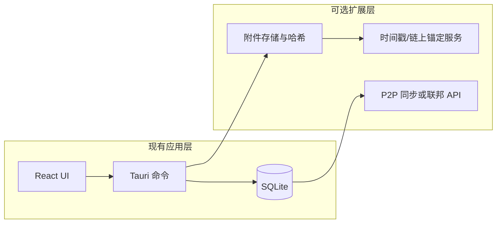

# 执法证据闭环与 P2P/区块链能力评估

> **Git 同步说明**：本文档与 Cursor 计划 `执法闭环与链能力评估_3059c967.plan.md` 内容同源，放入 `docs/` 便于版本跟踪。若只改一处，请同步或约定以仓库本文档为准。

## 执行总览（与 Cursor todos 对应）

- **阶段 A～E**（附件表、打印绑定、预审/正式审、纠错、权限）：见第六节表格。
- **SHA-256 + 替换快照 + 审计字段**：并入阶段 A/D；链 / TSA 为可选后续。
- **阶段 F**：监狱内网 P2P V1（`lib.rs` 注册命令 + 新模块；与附件模型并线）。

## 你描述的完整闭环（现状对照）

| 环节 | 当前仓库能力 | 说明 |
|------|----------------|------|
| 打印纸面笔录 | **有** | [`RecordFullReadingPreview.tsx`](../frontend/src/components/RecordFullReadingPreview.tsx) 调用 `window.print()`，配合 [`RecordFullReadingPreview.css`](../frontend/src/components/RecordFullReadingPreview.css) 的 `@media print` 隐藏壳层、只出纸面。 |
| 服刑人员纸质签名 | **流程外** | [`PROJECT_PLAN.md`](../PROJECT_PLAN.md) 已写明首版为「流程外纸质签名，不做电子签采集」；纸面组件底部有签名占位栏（如被询问人签名）。 |
| 扫描后上传回系统 | **无专门能力** | [`Record`](../frontend/src/api/types.ts) / `records` 表以正文 `content` + 审批状态为主，虽有 `signed_subject` 等布尔字段（[`db.rs` INSERT](../frontend/src-tauri/src/db.rs)），但**没有**「签字后扫描件路径 / 附件表 / 多页 PDF」等模型与 UI；[`db.rs`](../frontend/src-tauri/src/db.rs) 里其它 `file_path` 出现在导出等场景，**非笔录签字回扫**。 |
| 证据固定（防篡改、可审计） | **部分** | 本地 SQLite + 审计日志（仓库内已有审计相关命令/导出思路）可支撑**所内合规审计**；**不等同**于链上存证或跨机构互认。 |

结论：**打印闭环的前半段已在应用内；「签字 → 扫描 → 上传归档」的后半段尚未产品化，需要新增数据模型与 Tauri 文件能力（选路径、存附件、预览、与笔录绑定）。**

---

## 「P2P + 区块链去中心化」与当前技术栈的关系

**当前框架是否「自带」这些能力？——否。**

- **P2P**：代码中仅有状态栏占位文案「P2P：未启动」（[`GlassStatusBar.tsx`](../frontend/src/components/GlassStatusBar.tsx)），无 libp2p、无节点发现、无多副本同步协议。
- **区块链**：全仓库未发现链客户端、合约、钱包、IPFS 等集成；与 Tauri/React **不冲突**，但也不**自动提供**任何去中心化特性。

**是否「可以在这个框架上实现」？——可以，但作为显式选型的附加层。**

- **证据固定（务实路径）**：对「正文 + 扫描 PDF」做 **SHA-256**，可选对接 **TSA 时间戳** 或 **公有链/联盟链只做哈希锚定**（链上不存大文件），应用侧保留原文与审计日志。
- **去中心化同步（高复杂度）**：多狱点/offline-first 的 P2P 需要**冲突解决、身份与权限、可用性**等设计；通常更常见的是 **中心服务 + 加密同步** 或 **联盟链存证 + 本地业务库**，而非纯 P2P 业务库。

---

## 若产品上要落地「签字扫描回传」（建议方向）

1. **数据**：`record_attachments` 或 `signed_scan_path` + `signed_scan_sha256` + `uploaded_at` + `uploaded_by`；与 `records.id` 外键关联。
2. **存储**：Tauri [`dialog`](https://v2.tauri.app/plugin/dialog/) + [`fs` / `path`](https://v2.tauri.app/plugin/fs/) 将用户选择的扫描件复制到应用数据目录（避免只保存临时路径）。
3. **UI**：笔录详情中「已签字扫描件」列表、预览（PDF/图片）、替换/版本（若合规要求保留历史版本）。
4. **与 `signed_subject`**：上传并校验后可由人工或规则勾选「已收签字件」，与审批流衔接。

---

## 若仍坚持「链 + P2P」愿景（需单独决策）

- **链**：明确是「存证锚定」还是「业务状态上链」；后者成本高、与 SQLite 主业务易重复。
- **P2P**：明确同步范围（所内局域网 / 跨所）；多数监管场景仍偏 **可控中心 + 审计**，P2P 多为补充而非唯一真相源。

---

## 建议答复用户的一句话

当前项目是 **本地 SQLite 的执法业务应用**，**具备打印与纸面签名占位**，**尚未实现扫描回传附件**；**P2P/区块链不在框架内**，但可在 Tauri 侧 **外挂** 文件哈希、锚定服务或同步网关——需在合规与工程成本之间单独立项。

---

## 四、定稿需求摘要（与产品拍板合并，执行时以本节为准）

- **真相源**：服刑人员纸质**签名+捺印**后的**扫描 PDF**（或规定之 PDF/图片 ZIP）；系统结构化正文为过程稿，**预审**阶段不代表最终执法证据终稿。
- **闭环**：打印 → 民警纸质签 → 服刑人员签+捺印 → 扫描上传 →（预审可无扫描）→ 提交**生效扫描件**后进入**正式审** → 通过 → 归档；预审通过后**不强制 N 日内补扫**，**须持续提醒**。
- **版本**：`print_job_id` + `content_sha256` 绑定打印当时正文；扫描件**仅一份当前生效**；替换保留历史并标注；**历史版仅在线阅览、禁止下载**；**当前版可阅览、可下载**。
- **权限**：上传/替换扫描件 — **办案人 + 档案员**；下载当前版与历史在线阅览 — **档案岗 + 承办人**（与角色表实现时对齐）。
- **纠错**：替换扫描件走**一级纠错审批**；**归档后仍允许**纠错替换扫描件；替换时对**旧文件哈希快照** + **审计日志**（字段清单见下节任务）。
- **形态**：接受 **PDF** 或 **图片压缩包**；内网、**不要求国密**；纸质原件保管**不纳入**本期系统。
- **P2P**：**V1 必须**，范围**监狱内局域网**；目标含防篡改可审计与节点互助（与业务库同步策略在阶段 F 单写）。
- **文案**：统一「纸质签名、捺印」及与扫描件、预审/正式审关系。

**审计日志字段（建议最小集）**：`timestamp`、`actor_user_id`、`action`（`scan_upload` / `scan_replace_request` / `scan_replace_approve` / `scan_replace_apply` 等）、`record_id`、`attachment_id`、`old_attachment_id`、`old_sha256`、`new_sha256`、`print_job_id`、`correction_approval_id`、`detail`。

---

## 五、现状仓库锚点（执行前速查）

| 领域 | 路径 |
|------|------|
| SQLite 与笔录 CRUD | [`frontend/src-tauri/src/db.rs`](../frontend/src-tauri/src/db.rs) |
| Tauri 命令注册 | [`frontend/src-tauri/src/lib.rs`](../frontend/src-tauri/src/lib.rs) `invoke_handler` |
| 前端 invoke 封装 | [`frontend/src/api/tauri.ts`](../frontend/src/api/tauri.ts) |
| 类型定义 | [`frontend/src/api/types.ts`](../frontend/src/api/types.ts) |
| 笔录制作/弹窗主 UI | [`frontend/src/pages/RecordsPage.tsx`](../frontend/src/pages/RecordsPage.tsx) |
| 审批列表/操作 | [`frontend/src/pages/ApprovalsPage.tsx`](../frontend/src/pages/ApprovalsPage.tsx) |
| 纸面预览/打印 | [`frontend/src/components/RecordFullReadingPreview.tsx`](../frontend/src/components/RecordFullReadingPreview.tsx)、[`RecordFullReadingPreview.css`](../frontend/src/components/RecordFullReadingPreview.css) |
| 只读查看弹窗 | [`frontend/src/components/RecordViewModal.tsx`](../frontend/src/components/RecordViewModal.tsx) |
| 依赖 | [`frontend/src-tauri/Cargo.toml`](../frontend/src-tauri/Cargo.toml)（已有 `tauri-plugin-dialog`、`sha2`） |
| 构建与安全 | [`frontend/src-tauri/tauri.conf.json`](../frontend/src-tauri/tauri.conf.json)（CSP：`img-src` 已含 `blob:`，预览若用 blob URL 需留意） |

**常用命令**（在 [`frontend`](../frontend) 目录）：

- `npm run dev` — Vite 开发服（与 `tauri dev` 联用）
- `npm run build` — `tsc -b && vite build`
- `npm run tauri dev` — 完整桌面调试（以项目脚本为准，若根目录有封装则从根执行）
- `cargo clippy` / `cargo build` — 在 `frontend/src-tauri` 下校验 Rust

---

## 六、分阶段实施与文件级任务清单（与仓库合并，按序执行）

### 阶段 A — 扫描件「能存、能绑、能预览」

| 序号 | 任务 | 主要文件/位置 |
|------|------|----------------|
| A1 | 新增 `record_attachments`（及迁移）：`record_id` FK、`kind`、`stored_relative_path`、`mime`、`byte_size`、`sha256_hex`、`uploaded_at`、`uploaded_by`、`version`、`is_current`、替换链字段 | `frontend/src-tauri/src/db.rs`（`init` 迁移 + CRUD）、`frontend/src/api/types.ts` |
| A2 | 实现 `import_record_attachment`：选路径（前端 `dialog` 或 Rust 侧 open）、复制到 `app_data_dir()/attachments/records/{record_id}/`、SHA-256、写库 | 新模块建议 `frontend/src-tauri/src/attachments.rs` 或在 `db.rs` 增块；`lib.rs` 注册 command |
| A3 | `list_record_attachments`、`get_attachment_bytes` 或受控路径供预览；**当前版下载**单独 command（权限先 TODO 或硬编码角色） | 同上 + `tauri.ts` 新增 `invoke` 封装 |
| A4 | 笔录详情 UI：上传、列表、当前/历史标签、预览（PDF：内嵌 viewer 或新窗口；ZIP：列目录或解压临时预览）、下载按钮仅当前版 | `RecordsPage.tsx`；可选新组件 `RecordSignedScanPanel.tsx` |
| A5 | 最小审计：`log_audit_as` 或现有审计表写入 `scan_upload` | `db.rs`（检索现有 `log_audit` 模式） |

**验收命令**：`npm run build`；`cargo build`（`src-tauri`）；手测 Tauri 内上传/列表/预览。

---

### 阶段 B — 打印任务与正文版本绑定

| 序号 | 任务 | 主要文件/位置 |
|------|------|----------------|
| B1 | 新表 `print_jobs` 或 `records` 上字段：`print_job_id`（UUID）、`printed_content_sha256`、`printed_at`、`printed_by`；每次触发「定稿打印」插入 | `db.rs`、`types.ts` |
| B2 | 在 [`RecordFullReadingPreview.tsx`](../frontend/src/components/RecordFullReadingPreview.tsx) 的 `print()` 前或后调用 command：固化当前 `content` 的 SHA-256 并生成 `print_job_id`，返回给前端展示可选 | `RecordFullReadingPreview.tsx`、`RecordsPage.tsx`（若从制作页打印则两处入口需统一） |
| B3 | 上传扫描件时必选 `print_job_id`（默认最近一次） | `RecordsPage.tsx` + import command 参数 |

**验收**：同一笔录多次打印多条 job；扫描绑定可查询。

---

### 阶段 C — 预审 / 正式审 + 提醒

| 序号 | 任务 | 主要文件/位置 |
|------|------|----------------|
| C1 | `records.status` 扩展或新字段：`review_phase` = `draft` / `pre_approved` / `formal_pending` / `approved` / `archived` 等（与现有 `Draft/Pending/Approved` 映射需设计迁移） | `db.rs`、`types.ts`、`submit_record_for_approval` / `approve_record` 逻辑 |
| C2 | 无扫描件允许提交**预审**；有生效扫描件后才可进入**正式审**队列 | `RecordsPage.tsx`、`ApprovalsPage.tsx`、`db.rs` |
| C3 | 全局提醒：「已预审、无生效扫描」列表角标或 [`GlassStatusBar.tsx`](../frontend/src/components/GlassStatusBar.tsx) / 首页 [`HomePage.tsx`](../frontend/src/pages/HomePage.tsx) | 视导航结构选一或组合 |
| C4 | 产品文案常量：纸质签名、捺印、预审/正式审说明 | 新建 `frontend/src/config/recordEvidenceCopy.ts` 或写入现有 config |

**验收**：状态流转符合拍板；提醒可见且不阻断预审。

---

### 阶段 D — 纠错审批（一级）+ 归档后换扫

| 序号 | 任务 | 主要文件/位置 |
|------|------|----------------|
| D1 | 新表 `scan_correction_requests`：`record_id`、`requester`、`payload`、`status`、`approver_id`、`decided_at` | `db.rs` |
| D2 | 申请替换 → 审批通过 → 执行附件版本切换 + **旧 sha256 快照表**（或写在 attachment 行 `superseded_sha256_snapshot`） | `db.rs` |
| D3 | 归档后仍允许发起同一子流程 | `db.rs` 状态检查（去掉「仅 Draft」限制） |
| D4 | 审批 UI：一级通过按钮 | `ApprovalsPage.tsx` 或新路由 |

**验收**：历史不可下载可预览；审计含旧哈希。

---

### 阶段 E — 权限收紧（后端强制）

| 序号 | 任务 | 主要文件/位置 |
|------|------|----------------|
| E1 | 在 `users`/`role` 上定义「办案人」「档案员」「档案岗」「承办人」与现有 `role` 字符串映射表 | `db.rs` 或常量模块 + 种子数据 |
| E2 | 每个附件 command 校验角色；下载/读历史与上传分离 | `attachments.rs` / `db.rs` + `getCurrentAuth()` in [`tauri.ts`](../frontend/src/api/tauri.ts) |

**验收**：非授权 `invoke` 返回明确错误；前端隐藏按钮与后端一致。

---

### 阶段 F — 监狱内网 P2P（V1 必做，建议 A 稳定后并线）

| 序号 | 任务 | 主要文件/位置 |
|------|------|----------------|
| F1 | 选型：所内 mDNS/UDP 发现 + 二进制同步协议草案，或先 HTTP 邻机发现（局域网广播范围） | 新目录 `frontend/src-tauri/src/p2p/` + `lib.rs` |
| F2 | 同步内容最小集：附件文件 + 哈希清单？或 WAL 片段？（需设计文档一页定边界） | 与 `db.rs` 协调只读快照或导出包 |
| F3 | UI：替换 [`GlassStatusBar.tsx`](../frontend/src/components/GlassStatusBar.tsx)「P2P：未启动」为真实状态（已连接节点数、同步中） | `GlassStatusBar.tsx` + React state / 事件 |
| F4 | 网络安全：仅绑定内网网卡或配置白名单 IP 段（配置可放本地 JSON） | `tauri.conf.json` / 运行时配置 |

**验收**：两台内网机器互见并完成一次附件或 DB 片段同步（以最终选型为准）。

---

### 执行节奏建议

- **不要一次性改完**：按 **A → B → C → D → E** 合并主分支；**F 与 A 尾期并行开发、合并晚于 A 稳定**。
- 每阶段结束：**`npm run build`** + **`cargo build`** + 本阶段手测清单勾选后再进入下一阶段。

---

## 七、与第二节「现状对照」的关系

第二节表格描述的是**撰写计划当时**的仓库能力；**第四节起为已定稿目标**。实现完成后应回头更新第二节表格为「已实现/部分实现」以免文档漂移（可选，非阻塞开发）。
